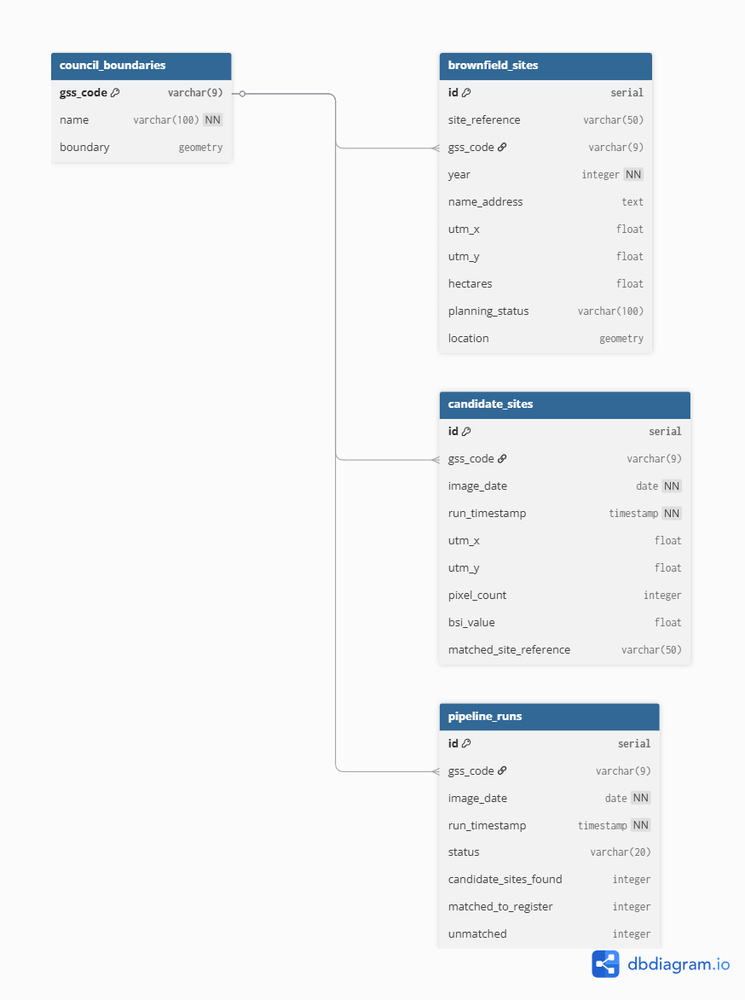

# Sentinel-2 Brownfield Site Detection — Database Design
Version 2.0 | Stoke-on-Trent Planning Intelligence Tool

## 1. Database Technology Decision
The program uses a database system. This was chosen as it solves a number of issues that a file-based system would have had originally. Firstly, the program would have experienced longer loading times if it had needed to perform all the conversions required for the mapping process every time it started. A database can instead store all of the processed mapping information once the initial conversion has been completed, significantly reducing loading times.

SQLite was first considered because of its simplicity. However, while SQLite can support spatial data through the SpatiaLite extension, it does not provide the same level of geospatial functionality or integration as PostGIS. PostgreSQL, when used with the PostGIS extension, is the industry standard for geospatial databases and provides native support for geographic data types and spatial operations such as point-in-polygon queries. This also removes the need for many of the geometry conversions previously performed using Shapely and provides a more scalable solution for the web interface introduced in Version 3.

The database was introduced in Version 2 so that council boundaries and the current Stoke-on-Trent brownfield data could be stored centrally. PostgreSQL 16 and PostGIS 3.5 were installed locally using Chocolatey, with a development database named sentinel2_brownfield. This provides a single location for storing all spatial datasets and allows additional data sources to be integrated more easily in future versions of the application.

## 2. Local Development Setup
The local development database is named sentinel2_brownfield. PostgreSQL is hosted locally using the default address of 127.0.0.1 on port 5432. The default PostgreSQL user account, postgres, is used to connect to the database during development.

A development password is configured for the local installation. This password is only intended for development purposes and should never be committed to Git or included within the source code. Instead, database credentials should be stored within a .env file, with the file excluded from version control using .gitignore. This ensures that sensitive information is not committed to the project repository while still allowing developers to configure their own local database connections.

The database can be accessed through the PostgreSQL command line tool using the following command:
```
psql -h 127.0.0.1 -p 5432 -U postgres -d sentinel2_brownfield
```
When the project is migrated to a hosted environment in Version 3, the database credentials, host address and connection details will differ from the local development configuration. These values will be provided by the hosting provider and configured separately for the production environment.

## 3. Table Structure

### 3.1 council_boundaries
```
CREATE TABLE council_boundaries (
    gss_code VARCHAR(9) PRIMARY KEY,
    name VARCHAR(100) NOT NULL,
    boundary GEOMETRY(POLYGON, 4326)
);
```

### 3.2 brownfield_sites
```
CREATE TABLE brownfield_sites (
    id SERIAL PRIMARY KEY,
    site_reference VARCHAR(50),
    gss_code VARCHAR(9) REFERENCES council_boundaries(gss_code),
    year INTEGER NOT NULL,
    name_address TEXT,
    utm_x FLOAT,
    utm_y FLOAT,
    hectares FLOAT,
    planning_status VARCHAR(100),
    location GEOMETRY(POINT, 32630)
);
```

### 3.3 candidate_sites
```
CREATE TABLE candidate_sites (
    id SERIAL PRIMARY KEY,
    gss_code VARCHAR(9) REFERENCES council_boundaries(gss_code),
    image_date DATE NOT NULL,
    run_timestamp TIMESTAMP NOT NULL,
    utm_x FLOAT,
    utm_y FLOAT,
    pixel_count INTEGER,
    bsi_value FLOAT,
    matched_site_reference VARCHAR(50)
);
```

### 3.4 pipeline_runs
```
CREATE TABLE pipeline_runs (
    id SERIAL PRIMARY KEY,
    gss_code VARCHAR(9) REFERENCES council_boundaries(gss_code),
    image_date DATE NOT NULL,
    run_timestamp TIMESTAMP NOT NULL,
    status VARCHAR(20),
    candidate_sites_found INTEGER,
    matched_to_register INTEGER,
    unmatched INTEGER
);
```

## 4. Table Relationships
The diagram below shows the relationships between the four tables. All three data tables (brownfield_sites, candidate_sites, pipeline_runs) reference council_boundaries via gss_code as a foreign key, ensuring all data is linked to a specific council area.



## 5. Version Roadmap
In Version 2, the database is introduced as the core component of the system. PostgreSQL with PostGIS is used to replace a file-based workflow and provides a centralised structure for all spatial data. At this stage, the database stores council boundary datasets and the current Stoke-on-Trent brownfield register. Historical Sentinel-2 imagery is processed and used to generate candidate brownfield sites. These candidate sites are then compared against the existing brownfield dataset to identify potential new development areas. This version establishes the core geospatial processing pipeline and ensures all key datasets are held in a single structured system.

In Version 3, the database is extended to support a full web-based application. An API layer is introduced between the database and the frontend, allowing spatial queries to be handled dynamically through PostGIS. Council boundary data becomes automatically downloaded and updated rather than manually imported. Where available, brownfield datasets are also automatically refreshed to ensure the system remains up to date. At this stage, the system is migrated from a local PostgreSQL instance to a hosted production database, improving scalability and allowing multi-user access. This version focuses on automation, accessibility, and integration with a web interface.

In Version 4, the system is expanded beyond a single local authority. The database structure is updated to support multiple cities and council areas within the same system. Users are able to select different regions, with each dataset stored and managed centrally within the same PostgreSQL/PostGIS environment. The processing pipeline is extended to handle multiple council boundaries and imagery sources, allowing automated analysis across different geographic areas. This version moves the system from a single-city tool into a scalable national framework with a more flexible data model and improved performance through optimised spatial indexing.

## 6. Migration Path — Local to Hosted
The current system runs on a local PostgreSQL instance installed on the development machine. This setup is used during Version 2 development and allows full control over schema design, PostGIS functionality, and spatial querying without reliance on external services.

The migration to a hosted database occurs in Version 3, at the point where the Streamlit-based web interface is introduced. At this stage, the system transitions from a single-user local environment to a web-accessible application requiring a persistent cloud-hosted database.

The chosen hosting platform for this migration is Supabase, which provides a managed PostgreSQL service with PostGIS support built in. It is selected specifically because it offers a free tier suitable for development and testing, while still supporting the full geospatial functionality required by the application.

During migration, the only required change is the database connection string. The underlying schema, spatial structure, and all SQL queries remain unchanged, meaning no modifications are required to the Python database interaction code.

All existing database logic continues to function as normal because Supabase is fully PostgreSQL-compatible. This ensures that spatial queries, indexing, and PostGIS operations behave identically to the local environment.

The primary advantage of Supabase in this context is that it is designed for exactly this type of application: geospatial data processing combined with a web front end. It removes the need to manage infrastructure manually while still providing full PostGIS capability and production-ready scalability.