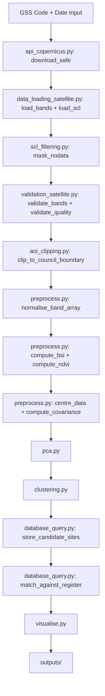
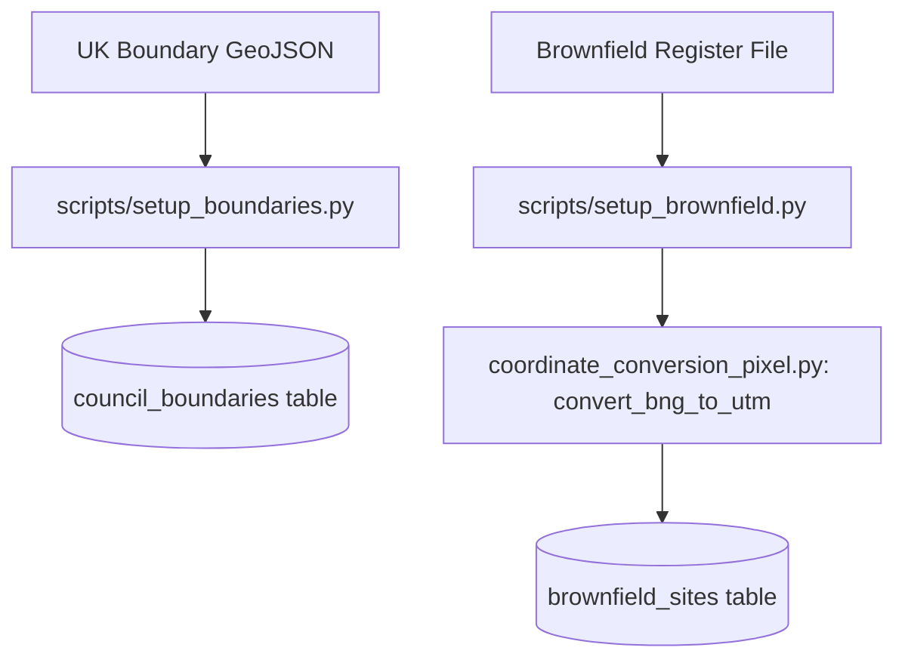

# DESIGN.md
## Sentinel-2 Brownfield Site Detection — Stoke-on-Trent
### Version 1.0 | Stoke City Council Planning Intelligence Tool

---

## 1. Requirements

This system is for UK local authority planning departments to help identify potential brownfield sites for further exploration. Initially developed for Stoke-on-Trent City Council, the system is designed to be configurable by GSS code, allowing any UK council to be processed without code changes from Version 2 onwards.

The system takes in raw data from the Copernicus Data Space Ecosystem. The Sentinel-2 L2A satellite carries a Multispectral Instrument (MSI) with 13 spectral bands. The data files input into the system are Sentinel-2 L2A SAFE folders containing JP2 band files at 10m, 20m and 60m resolution. In Version 2 these are downloaded automatically via the Copernicus API using GSS code and date as inputs. The bands used to investigate potential brownfield sites are bands 02, 03, 04, 05, 06, 07, 08, 8A, 11 and 12, processed at 20m resolution with 10m bands downsampled to 20m.

The system uses Bare Soil Index preprocessing and PCA spectral analysis to identify brownfield spectral signatures. Candidate sites are identified through pixel clustering and cross-referenced against the brownfield register stored in a PostgreSQL PostGIS database. The system outputs a false colour map, a results report, and stores candidate sites in the database for comparison against future pipeline runs.

The scope of the system is for candidate identification purposes and all outputs require follow-up investigation by planning officials before any planning decision is made.

**Version 1 Reproducibility Constraint:**
Version 1 is designed to produce reproducible results using a single specific Sentinel-2 image:
- Date: 2026-05-25
- Sensing time: 11:06:21 UTC
- Tile: T30UWD
- Product: S2C_MSIL2A_20260525T110621_N0512_R137_T30UWD_20260525T144513.SAFE

Results are only guaranteed to be reproducible when using this exact image. Any other image — different date, different AOI, different tile — may produce different results. Users who wish to reproduce the results documented in this project must download the exact product listed above following the instructions in raw_data/README.md.

Generalisation to other images and locations is a Version 2 objective, achieved through GSS code parameterisation and the Copernicus API download module.

## 2. Problem Formulation

In Version 2, the system first computes the Bare Soil Index (BSI) for each pixel using the formula BSI = ((B11+B04)-(B08+B02))/((B11+B04)+(B08+B02)). This pre-filters the pixel array to focus PCA analysis on spectrally relevant pixels, reducing noise from vegetation and urban surfaces before decomposition begins.

The system loads 10 spectral bands at 20m resolution and stacks them into a matrix where each row is a pixel and each column is a band. Before any analysis the data is centred by subtracting the mean of each band — this removes overall brightness differences between bands and ensures the covariance matrix measures variation not position. The system then computes the covariance matrix using the formula $\Sigma = (1/n)X^TX$, transposing the matrix onto itself creating a symmetric matrix.

The covariance matrix is then decomposed using the Spectral Theorem — $\Sigma = Q\Lambda Q^T$ — where Q contains the eigenvectors as columns and $\Lambda$ contains the eigenvalues on the diagonal. This is computed using numpy.linalg.eigh which is optimised for symmetric matrices and guarantees real eigenvalues and perpendicular eigenvectors. Each eigenvector represents a direction of spectral variation in the data and each eigenvalue represents how much variation exists in that direction.

Eigenvalues are then sorted by variance, this is so we can check which features have the biggest impact on the variation. The formula for each components variance is $\lambda_i / (\lambda_1 + \lambda_2 + \cdots + \lambda_n)$ the system will retain components that cumulatively explain 95% of variance. This threshold will be validated during implementation and adjusted if fewer or more components are needed to clearly distinguish brownfield spectral signatures. The chosen k is the point we meet the threshold. The data is then projected onto the top k eigenvectors using $X_{\text{reduced}} = X_{\text{centred}} \cdot Q[:,:k]$ — this transforms the original 10 band pixel matrix into a reduced representation capturing the most important spectral variation.

In Version 2, the projected pixel values are passed to the clustering module which groups neighbouring pixels with similar spectral signatures into discrete candidate sites. Each candidate site is assigned a pixel count, mean BSI value, and location. These candidate sites are then cross-referenced against the brownfield register stored in the PostgreSQL database using coordinate comparison to identify which candidates match known registered sites and which represent potential unregistered brownfield land.

The system then normalises the first 3 principal components to the range of 0-255 and assigns them to the 3 colour channels of an image. The false colour map always uses the top 3 principal components regardless of k — as a colour image has exactly 3 channels. Where k exceeds 3, the additional components contribute to the analysis but are not directly visualised. Matplotlib takes these 3 channels and renders them as a colour image. Pixels with similar spectral signatures get similar colours. Brownfield land will cluster into a similar colour, vegetation into another, and urban fabric into another.

## 3. Architecture
### Project Structure
```
sentinel2-brownfield-stoke/
├── src/
│   ├── data_loading_satellite.py  — Load and prepare Sentinel-2 band data
│   ├── scl_filtering.py           — Removes pixels based on SCL class
│   ├── validation_satellite.py    — Satellite image quality checks
│   ├── validation_database.py     — Database input validation
│   ├── preprocess.py              — Centre data, build covariance matrix, compute BSI and NDVI
│   ├── pca.py                     — Spectral decomposition, choose k, project
│   ├── coordinate_conversion_pixel.py — Converts external coordinates to UTM and pixel positions
│   ├── clustering.py              — Groups spectrally similar pixels into candidate sites
│   ├── database_query.py          — Runtime database queries and candidate site storage
│   ├── api_copernicus.py          — Copernicus API authentication and SAFE file download
│   ├── visualise.py               — False colour map, results report and interactive map
│   └── main.py                    — Pipeline orchestration
├── scripts/
│   ├── setup_boundaries.py        — One-time load of UK council boundaries into database
│   └── setup_brownfield.py        — Annual load of brownfield register into database
├── tests/
│   ├── __init__.py
│   ├── test_data_loading_satellite.py
│   ├── test_validation_satellite.py
│   ├── test_validation_database.py
│   ├── test_scl_filtering.py
│   ├── test_preprocess.py
│   ├── test_pca.py
│   ├── test_coordinate_conversion_pixel.py
│   ├── test_clustering.py
│   ├── test_database_query.py
│   ├── test_api_copernicus.py
│   ├── test_visualise.py
│   └── test_main.py
├── notebooks/
│   ├── 01_data_inspection_eda.ipynb
│   ├── 02_brownfield_register_eda.ipynb
│   ├── 03_boundary_file_eda.ipynb
│   └── 04_bsi_ndvi_calibration_eda.ipynb
├── data/                — Reference datasets committed to GitHub
│   ├── README.md
│   ├── brownfield_register_2019.csv
│   ├── brownfield_register_2020.csv
│   ├── brownfield_register_2021.csv
│   ├── brownfield_register_2022.xlsx
│   ├── brownfield_register_2023.csv
│   ├── brownfield_register_2024.csv
│   ├── contaminated_land_register.pdf
│   ├── contaminated_land_special_sites.csv
│   └── uk_local_authority_boundaries.geojson
├── docs/
│   └── images/
│       ├── false_colour_map.png
│       ├── database_erd.png
│       ├── bsi_ndvi_heatmap.png
│       └── bsi_ndvi_distribution.png
├── outputs/              — Generated false colour maps and results reports, gitignored except folder structure
├── raw_data/             — Sentinel-2 satellite imagery — not committed to GitHub
│   ├── README.md
│   └── S2C_MSIL2A_20260525T110621_N0512_R137_T30UWD_20260525T144513.SAFE/  — see README.md to download
├── .env                  — Local database credentials — never committed to git
├── DATABASE.md
├── DESIGN.md
├── EDA.md
├── README.md
└── requirements.txt
```
### Pipeline Flow

**Pipeline Flow 1 — Main Satellite Pipeline**


**Pipeline Flow 2 — Annual Setup Process**


### Module: data_loading_satellite.py — Load and Prepare Band Data

| Function | Input | Output | Purpose |
|---|---|---|---|
| _arrange_band_array | loaded_bands: list | np.ndarray (pixels, n_bands) | stacks list of 2D band arrays, tranposes to correct axis order, reshapes to (pixels, n_bands) |
| load_bands | safe_path: str | np.ndarray (pixels, 10) | Loads 10 selected bands at 20m, downsamples 10m bands |
| load_scl | safe_path: str | np.ndarray (5490, 5490) | Loads SCL_20m.jp2 for nodata masking  |
>**Note:** load_scl is specific to Sentinel-2 L2A products. Future versions supporting other satellite products will require a different masking approach.

### Module: scl_filtering.py - Removes Pixels Based on SCL Class

| Function | Input | Output | Purpose |
|---|---|---|---|
| mask_nodata | band_array: np.ndarray, scl_array: np.ndarray = None | tuple — (np.ndarray (valid_pixels, 10), np.ndarray or None (pixels,), tuple or None) | Removes pixels where SCL class = 0 (nodata) or SCL class = 1 (defective/saturated). Returns the filtered array, the boolean mask used, and the original 2D shape — needed by false_map_creation to reconstruct the image. If scl_array is None, masking is skipped and mask/original_shape are returned as None |

### Module: validation_satellite.py - All Quality Checks
| Function | Input | Output | Purpose |
|---|---|---|---|
| validate_path | safe_path: str | safe_path: str | Validates SAFE folder exists, raises FileNotFoundError if not |
| validate_bands | band_array: np.ndarray | bool | Checks array is 2D, number of columns matches bands selected, no negative values, no corrupt rows — raises ValueError if invalid |
| validate_quality | scl_array: np.ndarray, cloud_threshold: float = 0.10 | bool | Checks cloud cover does not exceed threshold - raises ValueError if image quality insufficient |

### Module: preprocess.py — Centre Data, Build Covariance Matrix and Compute Spectral Indices

| Function | Input | Output | Purpose |
|---|---|---|---|
| normalise_band_array | band_array: np.ndarray (pixels, n_bands) | normalised_array: np.ndarray (pixels, n_bands) | Converts raw Sentinel-2 digital number values to surface reflectance by dividing by 10,000. Must be applied before computing BSI or NDVI. Returns float64 array |
| centre_data | band_array: np.ndarray (pixels, 10) | centred_array: np.ndarray (pixels, 10) | Subtracts column mean from each band - centres data around zero |
| compute_covariance | centred_array: np.ndarray (pixels, 10) | covariance_matrix: np.ndarray (10, 10) | Computes $\Sigma = (1/n)X^TX$ — produces symmetric matrix for spectral decomposition |
| compute_bsi | band_array: np.ndarray (pixels, 10), bands_20m: list, bands_10m: list | bsi_array: np.ndarray (pixels,) | Computes Bare Soil Index using BSI = ((B11+B04)-(B08+B02))/((B11+B04)+(B08+B02)) — uses bands_20m and bands_10m combined with .index() to locate each band's column in band_array. Produces one BSI value per pixel |
| compute_ndvi | band_array: np.ndarray (pixels, 10), bands_20m: list, bands_10m: list | ndvi_array: np.ndarray (pixels,) | Computes Normalised Difference Vegetation Index using NDVI = (B08-B04)/(B08+B04) — uses bands_20m and bands_10m combined with .index() to locate each band's column in band_array. Produces one NDVI value per pixel |

### Module: pca.py — Spectral Decomposition, Choose k, Project

| Function | Input | Output | Purpose |
|---|---|---|---|
| spectral_decomposition | covariance_matrix: np.ndarray (10, 10) | eigenvalues: np.ndarray (10,), eigenvectors: np.ndarray (10, 10) | Decomposes covariance matrix using numpy.linalg.eigh - returns real eigenvalues and perpendicular eigenvectors |
| sort_variance | eigenvalues: np.ndarray (10,), eigenvectors: np.ndarray (10, 10) | sorted_eigenvalues: np.ndarray (10,), sorted_eigenvectors: np.ndarray (10, 10) | Sorts eigenvalues largest to smallest, reorders eigenvectors to match |
| cumulative_variance_for_k | sorted_eigenvalues: np.ndarray (10, ), variance_threshold: float = 0.95  | k: int | Calculates cumulative variance explained, returns k components needed to reach variance_threshold |
| project | centred_array: np.ndarray (pixels, 10), eigenvectors: np.ndarray (10, 10), k: int | X_reduced: np.ndarray (pixels, k) | Projects centred data onto top k eigenvectors using $X_{\text{reduced}} = X_{\text{centred}} \cdot Q[:,:k]$ |

### Module: coordinate_conversion_pixel.py — Converts External Coordinates to UTM and Pixel Positions

| Function | Input | Output | Purpose |
|---|---|---|---|
| convert_bng_to_utm | x: float, y: float | utm_position: dict | Converts a coordinate from EPSG:27700 (British National Grid) into EPSG:32630 (UTM Zone 30N) using pyproj.Transformer, matching the conversion already tested in 02_brownfield_register_eda.ipynb. utm_position contains the converted x and y values, ready to be passed into utm_coordinate_to_pixel |
| utm_coordinate_to_pixel | x: float, y: float, tile_metadata: dict | pixel_position: dict | Converts a UTM coordinate into a pixel position using column = int((x-left)/resolution) and row = int((top-y)/resolution) — tile_metadata supplies left, top and resolution from the satellite image. Used by register validation and AOI clipping to locate specific coordinates within the pixel grid |

### Module: aoi_clipping.py — Clips Satellite Image to Council Boundary

| Function | Input | Output | Purpose |
|---|---|---|---|
| clip_to_council_boundary | band_array: np.ndarray (pixels, 10), mask: np.ndarray (pixels,), original_shape: tuple, tile_metadata: dict, gss_code: str, connection | clipped_array: np.ndarray (valid_pixels, 10), clipped_mask: np.ndarray (pixels,) | Clips the satellite band array to only include pixels that fall within the council boundary retrieved from the database by GSS code. Uses matplotlib.path.Path for vectorised point-in-polygon checking across all valid pixels. Handles MultiPolygon boundaries by checking each polygon separately and combining results. Returns the clipped band array and updated boolean mask. Raises ValueError if no boundary found for the given GSS code |

### Module: clustering.py — Groups Spectrally Similar Pixels into Candidate Sites

| Function | Input | Output | Purpose |
|---|---|---|---|
| group_pixels_for_candidate_sites | X_reduced: np.ndarray (pixels, k), mask: np.ndarray (pixels,), original_shape: tuple, similarity_threshold: float = 0.1 | candidate_groups: dict — keys are site IDs, values are lists of pixel indices belonging to that site | Groups neighbouring pixels with similar spectral signatures into discrete candidate sites using connected-component approach. Pixels join the same site if spatially adjacent and spectrally similar within similarity_threshold. Uses mask and original_shape to reconstruct spatial relationships lost when image was flattened |
| calculate_site_properties | candidate_groups: dict, bsi_array: np.ndarray (pixels,), mask: np.ndarray (pixels,), original_shape: tuple, tile_metadata: dict | site_properties: list — list of dicts, one per site, each containing pixel_count, mean_bsi, centroid_utm_x, centroid_utm_y | Calculates properties for each candidate site — pixel count, mean BSI value across all site pixels, and centroid UTM coordinates converted using tile_metadata. Results are used for database storage and register matching |
| generate_boundary_polygons | candidate_groups: dict, mask: np.ndarray (pixels,), original_shape: tuple, tile_metadata: dict | site_polygons: list — list of dicts, one per site, each containing site_id and boundary polygon in UTM coordinates | Generates boundary polygon for each candidate site by tracing the outline of grouped pixels in the 2D grid and converting pixel positions to UTM coordinates using tile_metadata. Polygons are used for database storage and Folium interactive map display |

### Module: database_query.py — Runtime Database Queries and Candidate Site Storage

| Function | Input | Output | Purpose |
|---|---|---|---|
| retrieve_council_boundary_gss | gss_code: str, connection | boundary_polygon: dict | Queries council_boundaries table by GSS code and returns the council boundary polygon converted to EPSG:32630 using ST_Transform in PostGIS. Used by AOI clipping to constrain satellite image processing to the correct council area. Raises ValueError if GSS code not found |
| retrieve_brownfield_register_data | gss_code: str, year: int, connection | register_sites: list — list of dicts each containing site_reference, utm_x, utm_y | Queries brownfield_sites table for all register sites matching the given GSS code and year. Returns site locations in UTM coordinates ready for comparison against candidate sites. Raises ValueError if no data found |
| store_candidate_sites | candidate_sites: list, gss_code: str, image_date: str, run_timestamp: str, connection | None — writes to candidate_sites table | Stores candidate brownfield sites identified by the clustering module. Each site record includes GSS code, image date, run timestamp, UTM coordinates, pixel count, BSI value and register match status. Raises ValueError if candidate_sites is empty |
| store_pipeline_metadata | gss_code: str, image_date: str, run_timestamp: str, status: str, candidate_sites_found: int, matched_to_register: int, unmatched: int, connection | None — writes to pipeline_runs table | Stores pipeline run metadata after each completed run. Raises ValueError if status is not 'success' or 'failure' or if any count is negative |
| match_candidate_to_register | utm_x: float, utm_y: float, gss_code: str, year: int, connection, distance_threshold: float = 100.0 | str or None — site_reference of matched register site, or None if unmatched | Checks whether a candidate site's UTM coordinates match any registered brownfield site within the distance threshold using PostGIS ST_DWithin. Returns the closest matching site_reference or None if no match found within threshold |
| get_db_connection | None | connection: psycopg2 connection | Creates and returns a single psycopg2 connection to the sentinel2_brownfield database using credentials from .env. Called once in main.py and passed into all subsequent database functions |

### Module: validation_database.py — Database Input Validation

| Function | Input | Output | Purpose |
|---|---|---|---|
| validate_council_boundary_gss | gss_code: str, connection | bool | Validates GSS code format (9 characters, correct prefix) and confirms it exists in the council_boundaries table. Raises ValueError if format is invalid or GSS code is not found in database |
| brownfield_data_validation | gss_code: str, year: int, connection | bool | Confirms that brownfield register data exists in the brownfield_sites table for the given GSS code and year combination. Raises ValueError if no matching records are found — prevents pipeline running against missing register data |
| store_candidate_sites_validation | candidate_sites: list | bool | Validates candidate site data before database insertion — checks UTM coordinates are within valid range, pixel counts are positive, and BSI values fall within the expected range of -1 to 1. Raises ValueError if any site fails validation |
| store_pipeline_metadata_validation | gss_code: str, image_date: str, status: str, candidate_sites_found: int, matched_to_register: int, unmatched: int | bool | Validates pipeline run metadata before database insertion — checks status is a valid value (success or failure), all counts are non-negative integers, and image_date is correctly formatted. Raises ValueError if any field fails validation |

### Module: api_copernicus.py — Copernicus API Authentication and SAFE File Download

| Function | Input | Output | Purpose |
|---|---|---|---|
| get_access_token | None — credentials loaded from .env | token: str | Authenticates with the Copernicus Data Space Ecosystem using Keycloak token endpoint. Returns access token required for all subsequent API calls. Raises ValueError if authentication fails |
| get_bounding_box | boundary: dict — GeoJSON boundary polygon in EPSG:4326 | bbox: dict — containing west, east, south, north coordinates | Extracts a simple bounding box from a GeoJSON boundary polygon. Used to create a simplified search area for the Copernicus API rather than sending the full complex boundary polygon which exceeds URL length limits |
| search_products | gss_code: str, date: str, token: str, cloud_threshold: float = 0.10 | products: list — list of dicts each containing product_id, product_name, cloud_cover, sensing_date | Queries Copernicus OData catalogue for Sentinel-2 L2A products matching the council area bounding box (retrieved from database by GSS code), date and cloud cover threshold. Raises ValueError if no boundary found or no products found |
| download_safe | product_id: str, product_name: str, token: str, output_dir: str | safe_path: str — full path to extracted SAFE folder | Downloads SAFE file zip for the given product ID using the Copernicus zipper endpoint, extracts to output_dir, removes the zip file and returns the path to the extracted SAFE folder. Raises ValueError if download fails, zip is corrupted, or extracted SAFE folder is missing |

### Module: visualise.py — False Colour Map, Results Report and Interactive Map

| Function | Input | Output | Purpose |
|---|---|---|---|
| convert_k_to_rgb | X_reduced: np.ndarray (pixels, k) | rgb_array: np.ndarray (pixels, 3) | Takes top 3 principal components and normalises to 0-255 range for RGB colour channels. Raises ValueError if fewer than 3 components, empty array, or a component has zero variance |
| false_map_creation | rgb_array: np.ndarray (pixels, 3), output_dir: str, mask: np.ndarray = None, original_shape: tuple = None | None — saves false_colour_map_YYYYMMDD_HHMMSS.png to outputs/ | Reconstructs the full 2D image by placing valid pixels back into their original positions using mask and original_shape, with masked-out pixels rendered as black. If mask or original_shape is None, falls back to assuming a square image. Renders RGB array as false colour map using matplotlib and saves with timestamped filename to outputs/ |
| report_creation | k: int, sorted_eigenvalues: np.ndarray (10,), output_dir: str | None — saves results_report_YYYYMMDD_HHMMSS.md to outputs/ | Generates plain English results report for planning officials including variance explained and brownfield candidate findings — saves with timestamped filename to outputs/ |
| create_interactive_map | candidate_sites: list, output_dir: str, gss_code: str | None — saves interactive_map_YYYYMMDD_HHMMSS.html to outputs/ | Creates interactive Folium map with OpenStreetMap base layer. Converts candidate site UTM coordinates to lat/long using pyproj. Plots green markers for register-matched sites and red markers for unregistered candidates. Clickable popups show site reference, pixel count and BSI value. Saves as standalone HTML file viewable in any browser |

### Module: main.py — Pipeline Orchestration

| Function | Input | Output | Purpose |
|---|---|---|---|
| run_pipeline | gss_code: str, date: str, output_dir: str | None — saves outputs to outputs/ folder and stores candidate sites in database | Orchestrates the full Version 2 pipeline — calls api_copernicus download_safe, data_loading_satellite load_bands and load_scl, scl_filtering mask_nodata, validation_satellite validate_bands and validate_quality, preprocess compute_bsi, preprocess centre_data and compute_covariance, spectral_decomposition, sort_variance, cumulative_variance_for_k, project (k components for variance report), project (3 components for RGB map), clustering, database_query store_candidate_sites, database_query match_against_register, convert_k_to_rgb, false_map_creation, report_creation in sequence |

## 4. Risks

The system carries several risks that planning officials and future developers should be aware of.

The most significant risk in Version 1 was that the system had no geographic validation. It would process any valid Sentinel-2 L2A SAFE folder regardless of location. This has been addressed in Version 2 through AOI clipping using council boundary data stored in the PostgreSQL database, ensuring the pipeline only processes imagery relevant to the selected council area identified by GSS code.

Seasonal variation presents a second risk. The system was developed and tested using a May 2026 summer image captured during a heatwave with minimal cloud cover. Spectral signatures change significantly between seasons — winter imagery may contain snow or ice which has a similar spectral signature to bare soil and could be misclassified as brownfield land. Wet soils in autumn and winter also produce different spectral responses. Users should download summer imagery where possible and be cautious interpreting results from winter images.

The system may also experience spectral confusion between land cover types. Two different surfaces with similar spectral signatures in the selected bands may cluster together in the PCA and appear as the same colour on the false colour map. For example brownfield bare soil and agricultural bare soil may be indistinguishable. This is a fundamental limitation of unsupervised PCA — the system identifies spectral variation but cannot label land cover types with certainty. All outputs should be treated as candidate sites requiring physical verification. The Bare Soil Index preprocessing introduced in Version 2 partially mitigates this risk by filtering non-bare-soil pixels before PCA runs, but physical verification remains essential.

Brownfield sites in Stoke-on-Trent may be contaminated with heavy metals, coal tar or asbestos from former pottery, mining and steelworks industries. The system cannot distinguish between clean brownfield and contaminated brownfield — both produce similar spectral signatures. Candidate sites identified by this tool must be cross-referenced against the Environment Agency contaminated land register before any planning decision is made. Integration of contaminated land data is deferred to Version 4.

Missing or corrupted band files present a technical risk. If the downloaded SAFE folder is missing any of the 10 required bands the pipeline will raise a ValueError from validation_satellite.py before processing begins. In Version 2 the Copernicus API download introduced in api_copernicus.py reduces this risk by ensuring complete SAFE folders are downloaded automatically rather than relying on manual downloads.

The brownfield register coordinate system presents a data quality risk. The register does not explicitly state its coordinate reference system. Based on the numeric range of GeoX and GeoY values and cross-referencing against known site locations, the system infers EPSG:27700 (British National Grid). This inference is documented in 02_brownfield_register_eda.ipynb. If the coordinate system assumption is incorrect, all register site locations will be wrong after conversion. This risk is partially mitigated by the cross-validation performed during EDA, but cannot be fully eliminated without explicit metadata from the data publisher.

Finally the system was developed and validated against a single image. Results on different dates, different atmospheric conditions, or different seasonal contexts have not been tested. The 95% variance threshold and band selection were chosen based on this single image and may require adjustment for other dates or conditions.

## 5. Success Criteria

The pipeline is considered successful when all of the following conditions are met.

The outputs folder contains two timestamped files after a successful run — a false colour map saved as false_colour_map_YYYYMMDD_HHMMSS.png and a results report saved as results_report_YYYYMMDD_HHMMSS.md. If either file is missing the pipeline has not completed successfully.

The PCA pipeline is considered correct when all unit tests pass. Each module has at least one test per function — a minimum of 79 tests covering data loading, satellite validation, SCL filtering, preprocessing, PCA decomposition, coordinate conversion, visualisation and database queries. Edge cases including missing bands, corrupt arrays, excessive cloud cover, invalid coordinates and database connection failures must also be tested. The full test suite must pass with zero failures before the pipeline is considered production ready.

The false colour map is considered useful when it visually distinguishes at least three land cover types — brownfield bare soil, vegetation and urban fabric — as clearly different colours. Water bodies such as the River Trent should also appear as a distinct colour. The map should be interpretable by a planning official without data science knowledge.

The results report is considered complete when it contains the number of principal components retained, the variance explained by each component, a list of candidate brownfield sites identified by the clustering module, their match status against the brownfield register, and a plain English summary of the findings suitable for a non-technical planning official.

All pipeline runs must complete within a reasonable time — target under 5 minutes on a standard laptop for the full Stoke-on-Trent dataset, excluding the initial Copernicus API download time.

Candidate sites identified by the pipeline are stored in the candidate_sites table in the PostgreSQL database and automatically cross-referenced against the brownfield_sites table. The results report identifies which candidate sites match known registered sites and highlights potential unregistered brownfield land for further investigation by planning officials.

The database setup scripts must successfully load all 358 UK council boundaries into the council_boundaries table and all available years of Stoke-on-Trent brownfield register data into the brownfield_sites table before the pipeline can be considered fully operational.

## 6. Future Versions

| Version | Enhancement | Notes |
|---|---|---|
| v2 | PostgreSQL + PostGIS database | Central database replacing file-based workflow — stores council boundaries, brownfield register data, candidate sites and pipeline run history. Enables spatial queries natively without Shapely |
| v2 | Copernicus API download | Automated SAFE file download from Copernicus Data Space Ecosystem using GSS code and date as inputs — replaces manual download process |
| v2 | GSS code parameterisation | Pipeline accepts GSS code as input rather than hardcoded Stoke-on-Trent — enables any UK council to be processed without code changes |
| v2 | Module restructure | data.py renamed to data_loading_satellite.py, validation.py renamed to validation_satellite.py — establishes consistent naming convention for multi-source data pipeline |
| v2 | Geographic validation and AOI clipping | Pipeline clips satellite imagery to council boundary retrieved from database by GSS code — results consistent regardless of SAFE file coverage area |
| v2 | Bare Soil Index preprocessing | Calculate BSI prior to PCA — filters obvious non-brownfield pixels, provides independent validation of PCA results. BSI threshold must be calibrated for Stoke-on-Trent soil conditions and validated against the council brownfield register |
| v2 | Pixel clustering | Groups spectrally similar neighbouring pixels into discrete candidate sites — enables register comparison at site level rather than individual pixel level |
| v2 | Brownfield register validation | Cross-reference candidate sites against brownfield register stored in database — identifies overlap between PCA candidates and known registered sites, highlights potential unregistered sites |
| v2 | Change detection | Compare brownfield register across years using SQL queries — identifies sites added or removed between annual registers. Supports annual brownfield register update process |
| v2 | Interactive map output | Candidate sites overlaid onto OpenStreetMap base layer using Folium — outputs standalone HTML file to outputs/ alongside existing false colour map and results report. Green markers indicate register-matched sites, red markers indicate potential unregistered brownfield. Clickable popups show site reference, pixel count, BSI value and register match status |
| v3 | Streamlit web interface | Planning officials access via browser — no command line required — trigger pipeline by selecting council and date, receive map and report |
| v3 | Automated brownfield register download | Annual register downloaded automatically from data.gov.uk when new version is published — removes manual update requirement |
| v3 | Database migration to Supabase | Local PostgreSQL migrated to hosted Supabase instance — enables multi-user access and web interface integration |
| v3 | Supervised classification using brownfield register | Train Random Forest or SVM on Stoke-on-Trent brownfield register coordinates as ground truth labels — moves from candidate identification to validated probabilistic classification |
| v3 | Temporal spectral training data | Extract spectral signatures from historical Sentinel-2 images of known brownfield sites before development — creates verified before/after training pairs. Improves supervised classifier accuracy by distinguishing active brownfield from developed former brownfield |
| v4 | Multi-city expansion | Generalise pipeline to all UK councils using GSS code system already established in Version 2 — BSI thresholds and classifier retrained per council using local brownfield register data |
| v4 | Contaminated land integration | Integrate Environment Agency contaminated land register — cross-reference candidate sites against known contaminated locations. Requires assessment of PDF data source for machine-readable extraction |
| v4 | Automated scheduling | Pipeline runs automatically on new Copernicus image availability — no manual triggering required |

### Design Decisions for Future Versions

- validate_bands uses dynamic shape checking — not hardcoded to 10 bands — supports different band selections in future versions and multi-city expansion
- validate_quality cloud_threshold is configurable — default 0.10 — overridable for different seasonal conditions and geographic regions
- cumulative_variance_for_k variance_threshold is configurable — default 0.95 — may require adjustment for different cities or seasonal imagery
- validation_satellite.py is a separate module — new satellite quality checks can be added without touching data_loading_satellite.py — designed for extensibility
- mask_nodata scl_array is optional — defaults to None — supports future versions where SCL may not be available or where a different masking approach is used
- load_scl is specific to Sentinel-2 L2A — future versions supporting other satellite products will require a different masking approach
- Output files are timestamped — prevents overwriting on multiple runs — essential for change detection where multiple dated images are compared
- Geographic validation removed from Version 1 — AOI clipping implemented in Version 2 using council boundary data retrieved from PostgreSQL database by GSS code
- BSI threshold calibration deferred — requires validation against Stoke-on-Trent specific soil conditions and council brownfield register before integration into pipeline
- Temporal analysis deferred to Version 3 — requires historical Sentinel-2 imagery pipeline and before/after training pair extraction
- Multi-city expansion supported from Version 2 — GSS code parameterisation allows any UK council to be processed — per-city BSI calibration and classifier retraining addressed in Version 4
- Database introduced in Version 2 — PostgreSQL with PostGIS replaces file-based spatial data handling — schema designed for extensibility to additional councils and data sources
- Module naming convention established in Version 2 — data source prefix (data_loading_, validation_) ensures clarity as pipeline grows to handle multiple data sources
- Copernicus API introduced in Version 2 — automated SAFE download replaces manual process — credentials stored in .env file excluded from version control
- Contaminated land register deferred to Version 4 — current source is PDF format requiring manual processing before machine-readable extraction is possible
- Interactive map output uses Folium with OpenStreetMap — free, no API key required, outputs standalone HTML file compatible with any browser — upgrade path to Google Maps available in Version 3 via Streamlit-Folium integration