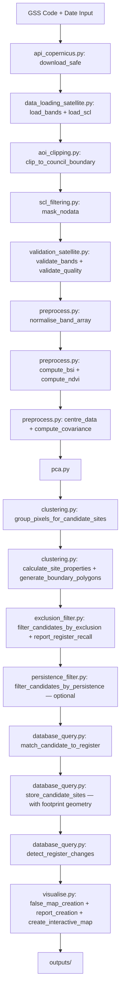
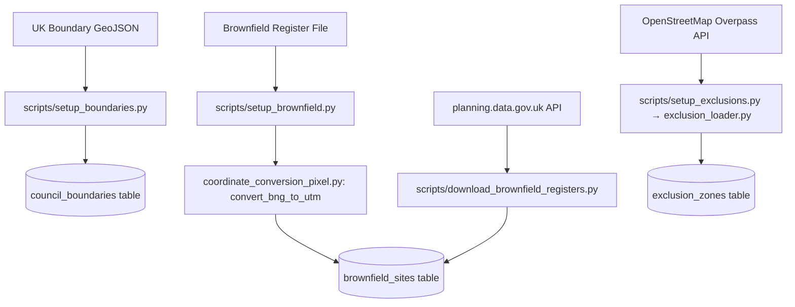
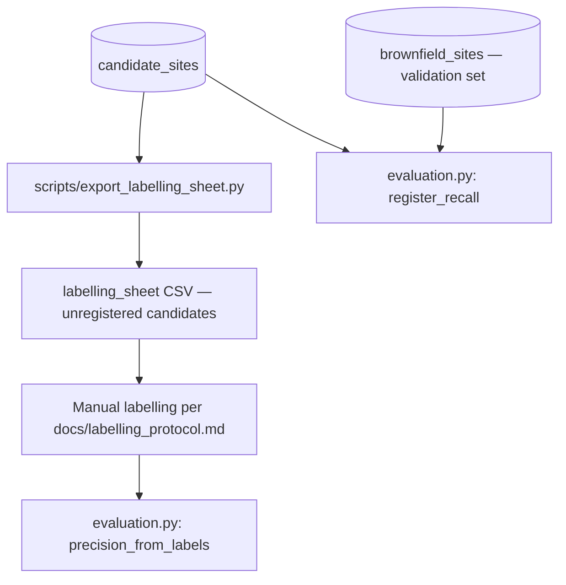

# Sentinel-2 Brownfield Site Detection — System Design
Version 2.0 | Brownfield Detection Pipeline | Stoke-on-Trent Planning Intelligence Tool

## 1. Project Overview

This system identifies potential unregistered brownfield land in UK council areas using free Sentinel-2 satellite imagery from the Copernicus Data Space Ecosystem. It automatically downloads imagery, applies spectral analysis and connected-component clustering to detect candidate brownfield sites, cross-references results against the council brownfield register, and produces a PDF report and interactive map for planning officials.

Version 2 is complete and running end-to-end for Stoke-on-Trent. The May 2026 Sentinel-2 image produced 218 candidate sites, of which 39 matched the 2024 brownfield register and 179 are potential unregistered brownfield sites. A July 2026 labelling pilot subsequently found these unregistered candidates are dominated by land-use false positives, and a July 2026 math/algorithm audit identified correctness fixes to detection itself — both are addressed by the Detection Correctness Foundation workstream (FND-1 to FND-6) alongside the exclusion filter (P1-5), temporal persistence (P1-4) and the evaluation harness (P1-1/P1-2), sequenced before the Application Sprint.

---

## 2. Project Status

| Version | Status | Description |
|---|---|---|
| v1 | ✅ Complete | PCA spectral analysis, false colour map, results report |
| v2 | ✅ Complete | Database, Copernicus API, BSI/NDVI clustering, AOI clipping, register matching, interactive map, PDF report, full CI test suite |
| v3 | Planned | Supervised Random Forest classifier, Streamlit web interface, Supabase migration |
| v4 | Planned | UK-wide multi-council expansion, automated scheduling |

---

## 3. Architecture

### Pipeline Flow 1 — Main Satellite Pipeline



### Pipeline Flow 2 — Database Setup



### Pipeline Flow 3 — Evaluation (P1-1 / P1-2)



---

## 4. Project Structure
```
sentinel2-brownfield-stoke/
├── src/
│   ├── data_loading_satellite.py       — Load and prepare Sentinel-2 band data
│   ├── scl_filtering.py                — Removes pixels based on SCL class
│   ├── validation_satellite.py         — Satellite image quality checks
│   ├── validation_database.py          — Database input validation
│   ├── preprocess.py                   — Centre data, build covariance matrix, compute BSI and NDVI
│   ├── pca.py                          — Spectral decomposition, choose k, project
│   ├── coordinate_conversion_pixel.py  — Converts external coordinates to UTM and pixel positions
│   ├── aoi_clipping.py                 — Clips satellite image to council boundary
│   ├── clustering.py                   — BSI/NDVI threshold-based candidate site detection
│   ├── exclusion_loader.py             — OSM land-use exclusion zone loader (Overpass API)
│   ├── exclusion_filter.py             — PostGIS area-overlap exclusion filtering (FND-4)
│   ├── persistence_filter.py           — Temporal persistence across image dates (P1-4)
│   ├── evaluation.py                   — Register recall and labelled precision (P1-2)
│   ├── database_query.py               — Runtime database queries and candidate site storage
│   ├── api_copernicus.py               — Copernicus API authentication and SAFE file download
│   ├── visualise.py                    — False colour map, PDF report and interactive map
│   └── main.py                         — Pipeline orchestration
├── scripts/
│   ├── setup_boundaries.py             — One-time load of UK council boundaries into database
│   ├── setup_brownfield.py             — Annual load of brownfield register into database
│   ├── setup_exclusions.py             — Load OSM exclusion zones for a council
│   ├── export_labelling_sheet.py       — Export unregistered candidates for manual labelling (P1-1)
│   └── download_brownfield_registers.py — Automated download from planning.data.gov.uk API
├── migrations/
│   ├── 001_initial_schema.sql          — Initial five-table PostGIS schema
│   ├── 002_exclusion_zones.sql         — Exclusion-zone table for non-brownfield land-use filtering (P1-5)
│   └── 003_candidate_geometry.sql      — Candidate footprint geometry column and GIST index (FND-3)
├── tests/
│   ├── __init__.py
│   ├── conftest.py                     — Path setup and autouse numpy seed for deterministic tests
│   ├── test_data_loading_satellite.py
│   ├── test_validation_satellite.py
│   ├── test_validation_database.py
│   ├── test_scl_filtering.py
│   ├── test_preprocess.py
│   ├── test_pca.py
│   ├── test_coordinate_conversion_pixel.py
│   ├── test_aoi_clipping.py
│   ├── test_clustering.py
│   ├── test_exclusion_loader.py
│   ├── test_exclusion_filter.py
│   ├── test_persistence_filter.py
│   ├── test_evaluation.py
│   ├── test_fnd_regressions.py         — Regression tests for the July 2026 audit findings
│   ├── test_database_query.py
│   ├── test_api_copernicus.py
│   ├── test_visualise.py
│   └── test_main.py
├── notebooks/
│   ├── 01_data_inspection_eda.ipynb
│   ├── 02_brownfield_register_eda.ipynb
│   ├── 03_boundary_file_eda.ipynb
│   ├── 04_bsi_ndvi_calibration_eda.ipynb
│   ├── 05_clustering_calibration_eda.ipynb
│   ├── 06_pipeline_results_validation.ipynb
│   └── 07_classifier_design.ipynb
├── data/                — Reference datasets committed to GitHub
│   ├── README.md
│   ├── brownfield_register_2019.csv
│   ├── brownfield_register_2020.csv
│   ├── brownfield_register_2021.csv
│   ├── brownfield_register_2022.xlsx
│   ├── brownfield_register_2023.csv
│   ├── brownfield_register_2024.csv
│   ├── contaminated_land_register.pdf
│   ├── contaminated_land_special_sites.csv
│   ├── uk_local_authority_boundaries.geojson
│   └── groundtruth/
│       ├── README.md
│       └── stoke_pilot_19.csv          — 19-site manual labelling pilot (P1-1), regression fixture for P1-5
├── docs/
│   ├── labelling_protocol.md           — Ground-truth labelling protocol (Dec 2024 NPPF PDL definition)
│   └── images/
│       ├── false_colour_map.png
│       ├── database_erd.png
│       ├── bsi_ndvi_heatmap.png
│       ├── bsi_ndvi_distribution.png
│       ├── clustering_threshold_comparison.png
│       ├── candidate_site_size_distribution.png
│       ├── candidate_site_locations.png
│       ├── pipeline_results_distribution.png
│       ├── change_detection_results.png
│       └── version3_implications.png
├── outputs/              — Generated outputs, gitignored except folder structure
├── raw_data/             — Sentinel-2 satellite imagery — not committed to GitHub
│   ├── README.md
│   └── S2C_MSIL2A_20260525T110621_N0512_R137_T30UWD_20260525T144513.SAFE/
├── .github/
│   └── workflows/
│       ├── security.yml                — gitleaks secret scan on push and PR
│       └── tests.yml                   — pytest suite on push and PR
├── .env                  — Local credentials — never committed to git
├── .env.example          — Template documenting required environment variables
├── .pre-commit-config.yaml — gitleaks, ruff and black hooks
├── pyproject.toml        — ruff and black configuration
├── pytest.ini
├── DATABASE.md
├── DESIGN.md
├── EDA.md
├── README.md
├── requirements.txt
└── requirements-ci.txt
```

---


## 5. Module Design

### Module: main.py — Pipeline Orchestration

| Function | Input | Output | Purpose |
|---|---|---|---|
| run_pipeline | gss_code: str, image_date: str, output_dir: str, min_persistence: int = 0 | None — saves outputs to output_dir, stores results in database | Orchestrates the full pipeline end-to-end. Downloads SAFE file via Copernicus API, opens single database connection passed through all database functions, runs all processing modules in sequence, applies the FND-4 exclusion filter and prints the register recall guardrail, optionally applies the P1-4 persistence filter (min_persistence >= 1), attaches each candidate's footprint geometry before storage (FND-3), stores results, generates three outputs (false colour map, PDF report, interactive map), deletes SAFE file on completion. Raises ValueError if GSS code invalid, no products found, or any validation fails. Status stored as success or failure regardless of outcome |

### Module: data_loading_satellite.py — Load and Prepare Sentinel-2 Band Data

| Function | Input | Output | Purpose |
|---|---|---|---|
| load_bands | safe_path: str | band_array: np.ndarray (height, width, 10) | Loads all 10 Sentinel-2 bands (6 at 20m native, 4 at 10m bilinearly resampled to 20m) from the SAFE folder. Returns a 3D array where the first two axes index pixel row and column and the third axis holds the 10 band readings in the order defined by bands_20m + bands_10m. The 3D grid is preserved so aoi_clipping can operate on the raw spatial arrays before mask_nodata flattens them. Raises FileNotFoundError if safe_path does not exist |
| load_scl | safe_path: str | scl_array: np.ndarray (height, width) | Loads the Scene Classification Layer from the SAFE folder at 20m resolution. Returns a 2D array of integer class values used by mask_nodata to remove defective pixels. Raises FileNotFoundError if safe_path does not exist |

### Module: scl_filtering.py — Remove Defective Pixels

| Function | Input | Output | Purpose |
|---|---|---|---|
| mask_nodata | band_array_2d: np.ndarray (height, width, 10), scl_array_2d: np.ndarray (height, width) | masked_array: np.ndarray (valid_pixels, 10), mask: np.ndarray (height * width,), original_shape: tuple | Drops nodata (SCL=0) and defective (SCL=1) pixels and flattens the grid to the (valid_pixels, 10) form used by preprocess, PCA and clustering. Out-of-boundary pixels already carry SCL=0 from aoi_clipping so they are removed here in the same pass. Returns the flat masked array, a boolean mask marking valid pixel positions in the flattened grid, and the original 2D shape needed to reconstruct the false colour map |

### Module: validation_satellite.py — Satellite Image Quality Checks

| Function | Input | Output | Purpose |
|---|---|---|---|
| validate_path | safe_path: str | None | Checks safe_path exists on disk and ends with .SAFE. Raises FileNotFoundError if path does not exist. Raises ValueError if path does not end with .SAFE |
| validate_bands | band_array: np.ndarray (pixels, 10) | None | Checks band_array has exactly 10 columns and at least 1 valid pixel. Raises ValueError if either condition fails |
| validate_quality | scl_array: np.ndarray (height, width) | None | Checks the proportion of valid pixels meets the minimum quality threshold. Raises ValueError if too many pixels are masked by clouds or defects |

### Module: validation_database.py — Database Input Validation

| Function | Input | Output | Purpose |
|---|---|---|---|
| validate_council_boundary_gss | gss_code: str, connection | bool: True | Validates GSS code format (letter followed by 8 digits) and confirms it exists in council_boundaries table. Raises ValueError if format invalid or GSS code not found |
| brownfield_data_validation | gss_code: str, year: int, connection | bool: True | Confirms brownfield register data exists for the given GSS code and year. Raises ValueError if no data found or year outside valid range 2000-2100 |
| store_candidate_sites_validation | candidate_sites: list | bool: True | Validates candidate site data before insertion — checks required keys exist, pixel count is positive, BSI within -1 to 1, UTM coordinates within valid UK range. Raises ValueError if any site fails validation |
| store_pipeline_metadata_validation | gss_code: str, image_date: str, status: str, candidate_sites_found: int, matched_to_register: int, unmatched: int | bool: True | Validates pipeline run metadata before insertion — checks GSS code format, date format YYYY-MM-DD, status is success or failure, all counts non-negative, matched plus unmatched does not exceed total. Raises ValueError if any check fails |

### Module: preprocess.py — Centre Data, Build Covariance Matrix and Compute Spectral Indices

| Function | Input | Output | Purpose |
|---|---|---|---|
| normalise_band_array | band_array: np.ndarray (pixels, n_bands) | normalised_array: np.ndarray (pixels, n_bands) | Converts raw Sentinel-2 digital number values to surface reflectance by dividing by 10,000. Must be applied before computing BSI or NDVI. Returns float64 array |
| centre_data | band_array: np.ndarray (pixels, 10) | centred_array: np.ndarray (pixels, 10) | Subtracts column mean from each band — centres data around zero |
| compute_covariance | centred_array: np.ndarray (pixels, 10) | covariance_matrix: np.ndarray (10, 10) | Computes covariance matrix for spectral decomposition |
| compute_bsi | band_array: np.ndarray (pixels, 10), bands_20m: list, bands_10m: list | bsi_array: np.ndarray (pixels,) | Computes Bare Soil Index using BSI = ((B11+B04)-(B08+B02))/((B11+B04)+(B08+B02)). Produces one BSI value per pixel |
| compute_ndvi | band_array: np.ndarray (pixels, 10), bands_20m: list, bands_10m: list | ndvi_array: np.ndarray (pixels,) | Computes Normalised Difference Vegetation Index using NDVI = (B08-B04)/(B08+B04). Produces one NDVI value per pixel |

### Module: pca.py — Spectral Decomposition

| Function | Input | Output | Purpose |
|---|---|---|---|
| spectral_decomposition | covariance_matrix: np.ndarray (10, 10) | eigenvalues: np.ndarray (10,), eigenvectors: np.ndarray (10, 10) | Computes eigenvalues and eigenvectors of the covariance matrix using np.linalg.eigh |
| sort_variance | eigenvalues: np.ndarray (10,), eigenvectors: np.ndarray (10, 10) | sorted_eigenvalues: np.ndarray (10,), sorted_eigenvectors: np.ndarray (10, 10) | Sorts eigenvalues and eigenvectors in descending order of variance explained |
| cumulative_variance_for_k | sorted_eigenvalues: np.ndarray (10,), variance_threshold: float = 0.80 | k: int | Returns the minimum number of components needed to explain variance_threshold of total variance, clamped to the number of components available so a floating-point sum at threshold 1.0 cannot overshoot. Default threshold is 0.80 — lowered from 0.95 in Version 2 to retain more spectral detail. A minimum of k=3 is enforced in main.py |
| project | centred_array: np.ndarray (pixels, 10), sorted_eigenvectors: np.ndarray (10, 10), k: int | X_reduced: np.ndarray (pixels, k) | Projects centred band data onto the top k principal components |

### Module: coordinate_conversion_pixel.py — Coordinate Conversion

| Function | Input | Output | Purpose |
|---|---|---|---|
| convert_bng_to_utm | bng_x: float, bng_y: float | utm: dict containing x and y | Converts British National Grid (EPSG:27700) coordinates to UTM Zone 30N (EPSG:32630) using the module-level pyproj Transformer, built once with always_xy=True so axis order is explicit rather than dependent on each CRS's native definition (FND-5), and reused across calls rather than rebuilt per call (FND-6). Used when loading brownfield register sites from CSV files which store coordinates in BNG |
| utm_coordinate_to_pixel | utm_x: float, utm_y: float, tile_metadata: dict | pixel: dict containing row and column | Converts a UTM coordinate to a pixel position in the satellite image using the tile's left edge, top edge and resolution from tile_metadata |

### Module: aoi_clipping.py — Clips Satellite Image to Council Boundary

| Function | Input | Output | Purpose |
|---|---|---|---|
| clip_to_council_boundary | band_array_2d: np.ndarray (height, width, 10), scl_array_2d: np.ndarray (height, width), tile_metadata: dict, gss_code: str, connection | tuple: (clipped_bands: np.ndarray (height, width, 10), clipped_scl: np.ndarray (height, width)) | Clips the raw satellite grid to the council boundary retrieved from the database by GSS code. Runs before SCL filtering — the 3D bands and 2D SCL come straight from data_loading_satellite. Uses matplotlib.path.Path for vectorised point-in-polygon checking across every pixel in the tile. Handles MultiPolygon boundaries by checking each polygon separately and combining results with a logical OR. Pixels outside the boundary are zeroed in the band array and set to SCL class 0 in the SCL array so that mask_nodata drops them alongside genuine nodata and defective pixels. Raises ValueError if no boundary found for the given GSS code or geometry type is unsupported |

### Module: exclusion_loader.py — OSM Land-Use Exclusion Zone Loader

| Function | Input | Output | Purpose |
|---|---|---|---|
| build_overpass_query | bbox: dict, exclusion_class: str | query: str | Builds an Overpass QL query for one exclusion class within a bounding box. Pure string building — no network — so the class-to-tag mapping in EXCLUSION_CLASSES is unit-testable. Queries both ways and relations so multipolygon land use is captured. Raises ValueError if class unknown |
| parse_osm_element | element: dict | dict or None | Parses one Overpass element into a GeoJSON geometry. Ways become Polygons; relations resolve outer/inner members into a Polygon with holes, or a MultiPolygon when several outer rings exist. Relation handling is why large industrial estates, parks and infrastructure sites — frequently multipolygons — are captured rather than skipped. Returns None if no usable geometry |
| fetch_osm_polygons | bbox: dict, exclusion_class: str | polygons: list — dicts of source_ref and GeoJSON geometry | Queries the Overpass API for one class within a bounding box and parses each element via parse_osm_element. The single network-bound function. Sends an identifying User-Agent, posts the query as a raw body, and backs off and retries on HTTP 429 rate limiting. Raises ValueError if the request ultimately fails |
| store_exclusion_zones | polygons: list, gss_code: str, exclusion_class: str, source: str, connection | stored: int — polygons written | Stores polygons in exclusion_zones, deleting existing rows for the same (gss_code, exclusion_class, source) first so re-runs replace rather than duplicate. Commits per row with per-row error isolation so one malformed geometry cannot poison the transaction and silently discard the batch. Geometry written in EPSG:4326 via ST_GeomFromGeoJSON |
| load_exclusions_for_council | gss_code: str, connection, classes: list = None | counts: dict — exclusion_class to polygon count | Orchestrates the full load for one council: retrieves the boundary, derives its bounding box, then fetches and stores every requested class from OSM. Defaults to all classes. Raises ValueError if no boundary found |

### Module: clustering.py — BSI/NDVI Threshold-Based Candidate Site Detection

| Function | Input | Output | Purpose |
|---|---|---|---|
| group_pixels_for_candidate_sites | X_reduced: np.ndarray (pixels, k), mask: np.ndarray (pixels,), original_shape: tuple, bsi_array: np.ndarray (pixels,), ndvi_array: np.ndarray (pixels,), bsi_threshold: float = 0.05, ndvi_threshold: float = 0.2, min_pixels: int = 5, max_pixels: int = 2500 | candidate_groups: dict — keys are site IDs, values are lists of pixel indices | Identifies candidate brownfield pixels using BSI and NDVI thresholds (BSI > bsi_threshold AND NDVI < ndvi_threshold), applies morphological dilation (iterations=1) as a connectivity scaffold, uses scipy.ndimage.label for connected-component labelling, then takes group membership as the labelled blob INTERSECTED with the pre-dilation candidate map (FND-1) — dilation-border pixels that never passed the thresholds are excluded, so mean_bsi and pixel counts are uncontaminated. The size filter applies to the true candidate count. Uses vectorised numpy sorting for efficient single-pass label grouping. Pipeline uses BSI>0.1, NDVI<0.2, min=10, max=2500 |
| calculate_site_properties | candidate_groups: dict, bsi_array: np.ndarray (pixels,), mask: np.ndarray (pixels,), original_shape: tuple, tile_metadata: dict | site_properties: list — list of dicts each containing site_id, pixel_count, hectares, mean_bsi, centroid_utm_x, centroid_utm_y | Calculates properties for each candidate site. Hectares calculated as pixel_count × 0.04 (each 20m pixel = 400m² = 0.04ha). Because membership contains only true threshold-passing pixels (FND-1), mean_bsi and hectares reflect the actual bare-soil footprint. Centroid UTM coordinates calculated from mean pixel row/column position using tile_metadata |
| generate_boundary_polygons | candidate_groups: dict, mask: np.ndarray (pixels,), original_shape: tuple, tile_metadata: dict | site_polygons: list — list of dicts each containing site_id and geometry (GeoJSON Polygon or MultiPolygon in EPSG:32630, or None) | Converts each site's pixel footprint to valid GeoJSON geometry using rasterio.features.shapes (FND-2): rings correctly ordered and closed, holes preserved, disconnected parts emitted as MultiPolygon, polygon area exactly pixel_count × 400 m². Replaces the superseded raster-order boundary-pixel trace, whose rings were self-intersecting and geometrically invalid. Output feeds candidate geometry storage (FND-3) and PostGIS area-overlap exclusion (FND-4) |

### Module: exclusion_filter.py — Non-Brownfield Exclusion Filtering (FND-4)

| Function | Input | Output | Purpose |
|---|---|---|---|
| compute_exclusion_overlap | geometry: dict (GeoJSON, EPSG:32630), gss_code: str, connection, classes: list = HARD_EXCLUSION_CLASSES, source: str = "osm" | overlap: float 0.0-1.0 | Computes the fraction of a candidate's AREA inside the given exclusion classes entirely in PostGIS: ST_Intersects pre-filters against the stored 4326 geometry so the GIST index is used, intersecting zones are unioned (order-independent), and ST_Area(ST_Intersection(...)) / ST_Area(candidate) is evaluated in EPSG:32630. True area overlap — replaces the size-biased vertex-ratio approximation of the superseded in-memory filter. Returns 0.0 for None geometry or no intersecting zones |
| filter_candidates_by_exclusion | site_properties: list, site_polygons: list, gss_code: str, connection, overlap_threshold: float = 0.5, classes: list = HARD_EXCLUSION_CLASSES, source: str = "osm" | tuple: (kept: list, dropped_count: int) | Drops candidates whose footprint area is majority-inside the HARD exclusion classes (car_park, quarry, agriculture, amenity_leisure — the classes measured as disjoint from registered brownfield). Building and infrastructure are deliberately NOT hard masks: 70 and 32 register sites respectively fall inside them, because registered brownfield IS previously-developed land; they return as classifier features in P1-6. Strictly greater-than threshold, candidates without geometry kept, deterministic input-order processing |
| report_register_recall | gss_code: str, connection, classes: list = HARD_EXCLUSION_CLASSES, source: str = "osm" | dict: register_sites, inside_exclusions | Standing recall metric printed every pipeline run: how many register sites (latest year) fall inside the hard exclusion classes. The register is the pipeline's validation set — this metric watches the filter's error and is never used as a mask override, which would hide the error signal |

### Module: persistence_filter.py — Temporal Persistence (P1-4)

| Function | Input | Output | Purpose |
|---|---|---|---|
| count_prior_detection_dates | utm_x: float, utm_y: float, gss_code: str, image_date: str, connection, distance_m: float = 50.0 | int | Counts distinct OTHER image dates with a stored candidate within distance_m of the location, via ST_DWithin on stored centroids. The current image date is excluded so a run never supports itself |
| filter_candidates_by_persistence | site_properties: list, gss_code: str, image_date: str, connection, min_prior_dates: int = 1, distance_m: float = 50.0 | tuple: (kept: list, dropped_count: int) | Drops candidates lacking nearby detections on at least min_prior_dates other stored image dates — transient bare soil (ploughed fields, construction phases) fails this; genuine brownfield persists. If the database holds fewer than min_prior_dates other dates for the council, the filter is skipped with a warning so a first run never erases itself. Enabled from main.py via --min_persistence (default 0 = off) |

### Module: evaluation.py — Precision and Recall Evaluation (P1-2)

| Function | Input | Output | Purpose |
|---|---|---|---|
| register_recall | gss_code: str, connection, run_timestamp: str = None (latest), distance_m: float = 100.0 | dict: run_timestamp, register_year, register_sites, detected, recall | Fraction of register sites (latest register year) with at least one stored candidate from the run within distance_m — the standing recall measurement against the validation set, computed identically every run so changes to detection and filtering are comparable over time. Raises ValueError if the council has no stored runs |
| precision_from_labels | labels_csv_path: str | dict: labelled, positives, precision | Reads a manually labelled candidate sheet (from scripts/export_labelling_sheet.py, labelled per docs/labelling_protocol.md) and computes the fraction labelled sellable. Unlabelled rows are excluded. Raises ValueError for a missing label column or zero labelled rows. CLI: python -m src.evaluation --gss_code E06000021 [--labels sheet.csv] |

### Module: database_query.py — Runtime Database Queries and Candidate Site Storage

| Function | Input | Output | Purpose |
|---|---|---|---|
| retrieve_council_boundary_gss | gss_code: str, connection | boundary_polygon: dict | Queries council_boundaries table by GSS code and returns the council boundary polygon converted to EPSG:32630 using ST_Transform in PostGIS. Used by AOI clipping. Raises ValueError if GSS code not found |
| retrieve_brownfield_register_data | gss_code: str, year: int, connection | register_sites: list — list of dicts each containing site_reference, utm_x, utm_y | Queries brownfield_sites table for all register sites matching the given GSS code and year, ordered by site_reference for deterministic output. Raises ValueError if no data found |
| store_candidate_sites | candidate_sites: list, gss_code: str, image_date: str, run_timestamp: str, connection | None — writes to candidate_sites table | Stores candidate brownfield sites identified by the clustering module. Each site record includes GSS code, image date, run timestamp, centroid_utm_x, centroid_utm_y, pixel_count, mean_bsi, matched_site_reference and — when present — the site's footprint geometry written to the geom column via ST_GeomFromGeoJSON in EPSG:32630 (FND-3). Sites without geometry store NULL. Raises ValueError if candidate_sites is empty |
| store_pipeline_metadata | gss_code: str, image_date: str, run_timestamp: str, status: str, candidate_sites_found: int, matched_to_register: int, unmatched: int, connection | None — writes to pipeline_runs table | Stores pipeline run metadata after each completed run. Raises ValueError if status is not success or failure or if any count is negative |
| match_candidate_to_register | utm_x: float, utm_y: float, gss_code: str, connection, distance_threshold: float = 100.0 | str or None — site_reference of matched register site or None | Checks whether a candidate site UTM coordinate matches any registered brownfield site within distance_threshold metres using PostGIS ST_DWithin. Automatically uses the most recent year of register data available for the given GSS code. Returns closest matching site_reference (site_reference tiebreak for equidistant sites) or None |
| detect_register_changes | gss_code: str, year_from: int, year_to: int, connection | dict — containing added and removed lists, each containing site_reference and name_address | Identifies brownfield register changes using start_date and end_date fields from planning.data.gov.uk data stored in brownfield_sites table. Sites with end_date between year_from and year_to were removed from the register (likely developed). Sites with start_date between year_from and year_to were newly added. For Stoke 2019-2024: 66 sites removed, 119 sites added. Raises ValueError if year_from >= year_to |
| get_db_connection | None | connection: psycopg2 connection | Creates and returns a single psycopg2 connection using credentials from .env. Called once in main.py and passed into all subsequent database functions |

### Module: api_copernicus.py — Copernicus API Authentication and SAFE File Download

| Function | Input | Output | Purpose |
|---|---|---|---|
| get_access_token | None — credentials loaded from .env | token: str | Authenticates with the Copernicus Data Space Ecosystem using Keycloak token endpoint. Returns access token required for all subsequent API calls. Raises ValueError if authentication fails |
| get_bounding_box | boundary: dict — GeoJSON boundary polygon in EPSG:4326 | bbox: dict — containing west, east, south, north coordinates | Extracts a simple bounding box from a GeoJSON boundary polygon. Used to create a simplified search area for the Copernicus API rather than sending the full complex boundary polygon which exceeds URL length limits |
| search_products | gss_code: str, date: str, token: str, cloud_threshold: float = 0.10 | products: list — list of dicts each containing product_id, product_name, cloud_cover, sensing_date | Queries Copernicus OData catalogue for Sentinel-2 L2A products matching the council area bounding box, date and cloud cover threshold. Raises ValueError if no boundary found or no products found |
| download_safe | product_id: str, product_name: str, token: str, output_dir: str | safe_path: str — full path to extracted SAFE folder | Downloads SAFE file zip using the Copernicus zipper endpoint, extracts to output_dir, removes the zip file and returns the path to the extracted SAFE folder. Raises ValueError if download fails, zip is corrupted, or extracted SAFE folder is missing |

### Module: visualise.py — False Colour Map, PDF Report and Interactive Map

| Function | Input | Output | Purpose |
|---|---|---|---|
| convert_k_to_rgb | X_reduced: np.ndarray (pixels, k) | rgb_array: np.ndarray (pixels, 3) | Takes top 3 principal components and normalises to 0-255 range for RGB colour channels. Raises ValueError if fewer than 3 components, empty array, or a component has zero variance |
| false_map_creation | rgb_array: np.ndarray (pixels, 3), output_dir: str, mask: np.ndarray = None, original_shape: tuple = None | None — saves false_colour_map_YYYYMMDD_HHMMSS.png to outputs/ | Reconstructs the full 2D image placing valid pixels back into their original positions using mask and original_shape, with masked-out pixels rendered as black. Saves as PNG with timestamped filename |
| report_creation | k: int, sorted_eigenvalues: np.ndarray, output_dir: str, gss_code: str, image_date: str, candidate_sites: list, change_detection: dict | None — saves results_report_YYYYMMDD_HHMMSS.pdf to outputs/ | Generates professional PDF report for planning officials using ReportLab. Includes executive summary, summary statistics table, unregistered candidate sites table (up to 20 sites), change detection summary, disclaimer and pipeline attribution footer. Raises ValueError if candidate_sites is None or change_detection missing required keys |
| create_interactive_map | candidate_sites: list, output_dir: str, gss_code: str | None — saves interactive_map_GSSCODE_YYYYMMDD_HHMMSS.html to outputs/ | Creates interactive Folium map with OpenStreetMap base layer. Converts candidate site UTM coordinates to lat/long using pyproj. Green markers for register-matched sites, red markers for unregistered candidates. Clickable popups show site type, estimated size in hectares, mean BSI and match status. Includes legend with matched and unregistered counts. Saves as standalone HTML viewable in any browser |

---

## 6. Key Architectural Decisions

**[DECISION] BSI/NDVI threshold approach replaces spectral similarity clustering**
The original connected-component approach using PCA spectral similarity failed — with k=2 at 95% variance threshold and 21 million pixels, the entire image formed one connected component regardless of threshold. BSI/NDVI thresholds applied after AOI clipping to Stoke (233,603 pixels) produce 218 meaningful candidate sites. Full calibration documented in notebooks/05_clustering_calibration_eda.ipynb.

**[DECISION] PCA variance threshold lowered to 0.80 with minimum k=3**
Original 0.95 threshold gave k=2 (PC1=82%, PC2=14%), insufficient for land cover discrimination within an urban area. k=3 minimum enforced in main.py.

**[DECISION] AOI clip before mask_nodata**
AOI clipping runs first on the raw 3D band grid and 2D SCL grid from data_loading_satellite. Pixels outside the council boundary have their band values zeroed and their SCL class set to 0, so mask_nodata drops them in the same pass as genuine nodata and defective pixels. For Stoke this means SCL filtering, normalisation, BSI/NDVI, PCA and clustering only see ~233,000 pixels instead of the ~21 million in the full tile — roughly a 90× reduction. As a side effect validate_quality now measures cloud coverage within the council boundary rather than across the full tile, which is the ratio the pipeline actually cares about. The original Version 2 order ran SCL masking first and clipped afterwards, which produced identical results but processed 21 million pixels through every downstream step.

**[DECISION] Morphological dilation iterations=1 — connectivity scaffold only (FND-1)**
Single iteration connects nearby candidate pixels across small gaps for labelling. iterations=2 was too aggressive, connecting unrelated patches into one massive component. Following the July 2026 audit, the dilated pixels are used ONLY to establish connectivity: group membership is the labelled blob intersected with the pre-dilation candidate map, because admitting dilation-border pixels diluted every site's mean_bsi downward and inflated pixel_count/hectares — biased values that were being stored and reported.

**[DECISION] Candidate boundaries traced with rasterio.features.shapes (FND-2)**
The original boundary trace emitted boundary pixels in raster (row-major) order and closed the ring, producing self-intersecting, geometrically invalid polygons — unusable for PostGIS storage or area computations. rasterio.features.shapes on each site's pixel grid emits valid, correctly ordered rings with holes preserved, tracing exact pixel edges so polygon area equals pixel_count × 400 m². rasterio is already a core dependency, so no new package.

**[DECISION] max_pixels=2500 (100 hectares) filter**
Removes spuriously large connected components caused by agricultural bare soil and other non-brownfield land cover. No genuine discrete brownfield site exceeds 100 hectares.

**[DECISION] One database connection opened in main.py and passed through all functions**
Prevents connection pool exhaustion and ensures consistent transaction state across all database operations in a single pipeline run.

**[DECISION] SAFE files downloaded, processed and deleted**
SAFE files are 600MB+. Storing permanently for 300+ UK councils would require terabytes of storage. Download on demand, delete after processing. Raw reference data (boundaries, register) stays in database permanently.

**[DECISION] Model binaries stored as BYTEA in PostgreSQL**
Avoids filesystem dependencies when deploying to Supabase in Version 3. Trained Random Forest models are small enough (5-20MB) to store in the database without hitting free tier limits.

**[DECISION] PCA chosen over UMAP, ICA, t-SNE, Random Projection and Autoencoders**
Sentinel-2 bands are highly correlated — adjacent wavelengths capture similar spectral information. PCA decorrelates them optimally and is the established standard in remote sensing literature for exactly this application. Key reasons for choosing PCA:

- **Interpretability** — PC1 captures overall brightness (82% variance), PC2 captures vegetation contrast (14%), PC3+ captures finer land cover variation. These have direct physical meaning that can be explained to planning officials and Geovation assessors.
- **Determinism** — PCA always produces the same result for the same input. UMAP and t-SNE are non-deterministic, producing different results on each run, which is incompatible with reproducible pipeline outputs.
- **Global structure preservation** — PCA preserves global spectral relationships across the full tile. UMAP and t-SNE are designed for local structure and visualisation, not feature extraction. They cannot project new data points consistently, which is required when the pipeline processes a new image.
- **Speed** — PCA on 21 million pixels via numpy covariance decomposition runs in under 30 seconds on a standard laptop. Autoencoders require GPU training and are overkill for 10 input dimensions.
- **Established precedent** — PCA is the standard dimensionality reduction approach in multispectral remote sensing. The Alan Turing Institute's DemoLand project and the broader satellite land classification literature use PCA for exactly this purpose.

The variance threshold was lowered from 0.95 to 0.80 with a minimum k=3 enforced in main.py, after finding that k=2 at 0.95 threshold was insufficient to discriminate between urban land cover types within Stoke.

**[DECISION] scipy.ndimage.label chosen over DBSCAN, HDBSCAN and Mean Shift for candidate site grouping**
The candidate site detection problem is fundamentally a spatial connectivity problem on a regular pixel grid, not a point cloud clustering problem. Key reasons for choosing connected-component labelling:

- **Problem fit** — DBSCAN and HDBSCAN operate on point clouds in feature space, grouping points by spectral similarity. The Version 2 approach applies BSI/NDVI thresholds first to create a binary candidate map, then groups spatially adjacent candidate pixels. Connected-component labelling is the correct algorithm for this — it finds spatially connected regions in a binary grid, which is exactly the operation needed.
- **Computational complexity** — scipy.ndimage.label is O(n) in the number of pixels. DBSCAN is O(n log n) at best and O(n²) at worst. At 233,603 Stoke pixels after AOI clipping, connected components runs in seconds. DBSCAN at this scale would be significantly slower.
- **No hyperparameter sensitivity** — DBSCAN requires tuning epsilon (neighbourhood radius) and min_samples. These parameters interact in non-obvious ways and would require calibration per council. Connected components with a fixed minimum pixel size is simpler and more interpretable.
- **Morphological dilation** — a single iteration of binary_dilation before labelling bridges small gaps between candidate pixels caused by mixed pixels at site edges or minor spectral noise. This is equivalent to what region growing algorithms do but with a single O(n) operation rather than an iterative algorithm.
- **Mean Shift** — computationally expensive at pixel scale, requires kernel bandwidth tuning, and operates in feature space rather than geographic space.

The original spectral similarity clustering approach used scipy.ndimage.label on all valid pixels — this failed because 21 million pixels form one spatially connected component. The fix was to apply BSI/NDVI thresholds first, creating a sparse binary candidate map before labelling. Full calibration is documented in notebooks/05_clustering_calibration_eda.ipynb.

**[DECISION] Exclusion-filter data source — OSM now, source swappable per class (P1-5)**
The exclusion filter masks known non-opportunity land-use polygons out of the candidate search. A July 2026 labelling pilot found the raw BSI/NDVI detector fires on any bare or hard man-made surface with no land-use awareness — 19 of 19 sampled candidates were non-sellable false positives across these classes. OpenStreetMap is used as the initial data source because it is the only free source with land-use tagging granular enough to match those classes. OSM is licensed under ODbL, whose share-alike terms are a commercial-ship question rather than a build question — for a written application and proof site no data product is distributed, so it does not bite yet, and it is logged as a blocking item on the P4-8 licensing review. The exclusion_zones table carries a source column per polygon so the data source is swappable per class: OS OpenData (OGL, licence-clean) can replace individual classes — building footprints in particular — later as a configuration change rather than a rewrite.

**[DECISION] Hard exclusion classes limited to those disjoint from brownfield; building/infrastructure become classifier features (FND-4)**
A live Stoke run with all six OSM classes as hard masks measured 114 of 352 register sites (32%) falling inside exclusion zones — building 70, infrastructure 32, car_park 13, amenity_leisure 10. Building and infrastructure overlap the DEFINITION of brownfield (previously-developed land has buildings and was often industrial), so using them as hard masks rejects the target itself: a hard mask cannot distinguish a derelict former works (keep — it is the brownfield) from an active factory (drop). Hard exclusion is therefore limited to the classes measured as disjoint — car_park, quarry, agriculture, amenity_leisure — while building and infrastructure overlaps return as FEATURES the P1-6 classifier weighs against spectral evidence. The register is treated as a standing validation set: report_register_recall watches the filter's false-exclusion rate every run and is never used as a mask override, which would hide the very error signal it exists to expose.

**[DECISION] Exclusion overlap computed as indexed PostGIS area-intersection (FND-4)**
The superseded in-memory filter measured the fraction of boundary VERTICES inside exclusion zones — a perimeter proxy biased by candidate size and shape — and tested every candidate against every polygon in Python (O(candidates × polygons)), bypassing the GIST index built in migration 002. The FND-4 filter computes ST_Area(ST_Intersection(candidate, zones)) / ST_Area(candidate) in PostGIS: unbiased true area overlap, GIST-index pre-filtering via ST_Intersects, order-independent ST_Union accumulation, and deterministic results run to run. This requires candidate geometry to exist as valid polygons (FND-2) and be available to PostGIS (FND-3) — which is why those tickets precede it.

**[DECISION] Coordinate transforms use always_xy=True and a module-level Transformer (FND-5/FND-6)**
Without always_xy, pyproj uses each CRS's native axis order; the BNG→UTM transform worked only because both projected CRS happen to agree on easting/northing, and any geographic CRS entering the chain would silently swap axes. always_xy=True makes the (x, y) order explicit. The Transformer is built once at module level rather than per call — construction is expensive and the function runs once per register site during setup.

---

## 7. Known Issues and Deferred Work

The Detection Correctness Foundation milestone (FND-1 to FND-6, GitHub issues #83-#88) is sequenced before the Application Sprint, following the July 2026 math/algorithm audit of the full pipeline. FND-1 (dilation contamination) and FND-2 (invalid boundary rings) corrupt values already stored and reported, FND-3/FND-4 replace the superseded in-memory exclusion masker with indexed PostGIS area-overlap, and FND-5/FND-6 harden coordinate transforms. The audit also cleared several suspects as NOT bugs: the 1/n covariance estimator (immaterial for PCA), BSI/NDVI scale-invariance to normalisation, and the divide-by-zero handling in both indices.

Building and infrastructure land-use overlap is deliberately not a hard exclusion — it eats registered brownfield (70 and 32 register sites respectively). Distinguishing derelict from active developed land is the P1-6 classifier's job, with the overlap fractions as input features.

Temporal persistence (P1-4) requires the pipeline to have run on more than one image date per council before it can filter; until then it passes through with a warning.

The exclusion filter uses OpenStreetMap data under the ODbL licence. The share-alike terms are a commercial-ship question rather than a build question — no data product is distributed for the written Geovation application, so the obligation does not bite yet — but it must be cleared before any paying-customer product ships. This is logged as a blocking item on the P4-8 licensing review, with OS OpenData (OGL, licence-clean) identified as the fallback for building footprints.

---

## 8. Roadmap

Following the July 2026 strategy revision, the product is framed as off-market land-buyer leads rather than a council tool, and work is organised around delivery milestones rather than version numbers. The Detection Correctness Foundation milestone precedes the Application Sprint for the Geovation application (deadline 31 August 2026); the full schedule is maintained in 06_Backlog_Review_and_Schedule.md.

**Completed:**
- PostgreSQL/PostGIS database with 361 UK council boundaries and six-year Stoke brownfield register
- Copernicus API automated download, AOI clipping, BSI/NDVI threshold clustering, register matching, change detection
- PDF report, interactive Folium map, false colour map
- Secret rotation and pre-commit/CI secret scanning (P0-1, P0-2)
- Ground-truth labelling protocol and 19-site manual pilot (P1-1 groundwork)
- OSM exclusion-zone loader and 38,702-polygon Stoke load (P1-5 loader half)
- Comprehensive test suite run in CI

**Current — Detection Correctness Foundation (before Application Sprint):**
- Uncontaminated group membership: dilation as connectivity scaffold only (FND-1)
- Valid candidate boundary polygons via rasterio.features.shapes (FND-2)
- Candidate footprint geometry persisted with GIST index (FND-3, migration 003)
- Exclusion filter as indexed PostGIS area-overlap over the disjoint hard classes, with the register recall guardrail (FND-4, supersedes the in-memory P1-5 masker)
- Explicit axis order and module-level coordinate transformer (FND-5, FND-6)
- Temporal-persistence filter across stored image dates (P1-4)
- Labelling-sheet export tooling and manual labelling of the filtered candidate set (P1-1), precision/recall evaluation harness (P1-2)

**Then — Application Sprint:**
- One owner-attributed proof site via manual Land Registry lookup (APP-1)
- Land-buyer customer discovery conversations (APP-2)
- Draft and submit the Geovation application (APP-3)

**Next — after Geovation:**
- Supervised Random Forest classifier trained on register-site spectral signatures, with building/infrastructure overlap fractions as input features and calibrated confidence scores (per-council models in the council_models table) (P1-6)
- Ownership integration (HMLR/Land Registry) and developability scoring for qualified leads
- Data-licensing and commercial-terms review, including the OSM/ODbL question (P4-8)
- Supabase migration and a light hosted interface
