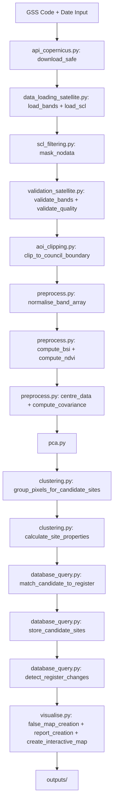
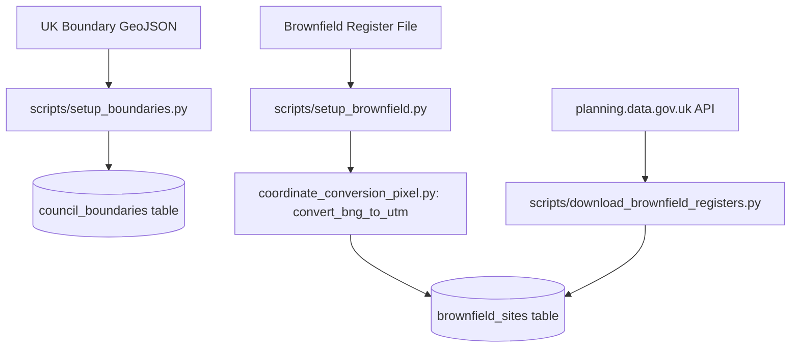

# Sentinel-2 Brownfield Site Detection — System Design
Version 2.0 | SiteSignal Ltd | Stoke-on-Trent Planning Intelligence Tool

## 1. Project Overview

This system identifies potential unregistered brownfield land in UK council areas using free Sentinel-2 satellite imagery from the Copernicus Data Space Ecosystem. It automatically downloads imagery, applies spectral analysis and connected-component clustering to detect candidate brownfield sites, cross-references results against the council brownfield register, and produces a PDF report and interactive map for planning officials.

Version 2 is complete and running end-to-end for Stoke-on-Trent. The May 2026 Sentinel-2 image produced 218 candidate sites, of which 39 matched the 2024 brownfield register and 179 are potential unregistered brownfield sites.

---

## 2. Project Status

| Version | Status | Description |
|---|---|---|
| v1 | ✅ Complete | PCA spectral analysis, false colour map, results report |
| v2 | ✅ Complete | Database, Copernicus API, BSI/NDVI clustering, AOI clipping, register matching, interactive map, PDF report, 251 tests |
| v3 | Planned | Supervised Random Forest classifier, Streamlit web interface, Supabase migration |
| v4 | Planned | UK-wide multi-council expansion, automated scheduling |

---

## 3. Architecture

### Pipeline Flow 1 — Main Satellite Pipeline



### Pipeline Flow 2 — Database Setup



---

## 4. Project Structure
```
sentinel2-brownfield-stoke/
├── src/
│   ├── data_loading_satellite.py       — Load and prepare Sentinel-2 band data
│   ├── scl_filtering.py                — Removes pixels based on SCL class
│   ├── validation_satellite.py         — Satellite image quality checks
│   ├── validation_database.py          — Database input validation
│   ├── preprocess.py                   — Centre data, build covariance matrix, compute BSI and NDVI
│   ├── pca.py                          — Spectral decomposition, choose k, project
│   ├── coordinate_conversion_pixel.py  — Converts external coordinates to UTM and pixel positions
│   ├── aoi_clipping.py                 — Clips satellite image to council boundary
│   ├── clustering.py                   — BSI/NDVI threshold-based candidate site detection
│   ├── database_query.py               — Runtime database queries and candidate site storage
│   ├── api_copernicus.py               — Copernicus API authentication and SAFE file download
│   ├── visualise.py                    — False colour map, PDF report and interactive map
│   └── main.py                         — Pipeline orchestration
├── scripts/
│   ├── setup_boundaries.py             — One-time load of UK council boundaries into database
│   ├── setup_brownfield.py             — Annual load of brownfield register into database
│   └── download_brownfield_registers.py — Automated download from planning.data.gov.uk API
├── tests/
│   ├── init.py
│   ├── test_data_loading_satellite.py
│   ├── test_validation_satellite.py
│   ├── test_validation_database.py
│   ├── test_scl_filtering.py
│   ├── test_preprocess.py
│   ├── test_pca.py
│   ├── test_coordinate_conversion_pixel.py
│   ├── test_aoi_clipping.py
│   ├── test_clustering.py
│   ├── test_database_query.py
│   ├── test_api_copernicus.py
│   ├── test_visualise.py
│   └── test_main.py
├── notebooks/
│   ├── 01_data_inspection_eda.ipynb
│   ├── 02_brownfield_register_eda.ipynb
│   ├── 03_boundary_file_eda.ipynb
│   ├── 04_bsi_ndvi_calibration_eda.ipynb
│   ├── 05_clustering_calibration_eda.ipynb
│   └── 06_pipeline_results_validation.ipynb
├── data/                — Reference datasets committed to GitHub
│   ├── README.md
│   ├── brownfield_register_2019.csv
│   ├── brownfield_register_2020.csv
│   ├── brownfield_register_2021.csv
│   ├── brownfield_register_2022.xlsx
│   ├── brownfield_register_2023.csv
│   ├── brownfield_register_2024.csv
│   ├── contaminated_land_register.pdf
│   ├── contaminated_land_special_sites.csv
│   └── uk_local_authority_boundaries.geojson
├── docs/
│   └── images/
│       ├── false_colour_map.png
│       ├── database_erd.png
│       ├── bsi_ndvi_heatmap.png
│       ├── bsi_ndvi_distribution.png
│       ├── clustering_threshold_comparison.png
│       ├── candidate_site_size_distribution.png
│       ├── candidate_site_locations.png
│       ├── pipeline_results_distribution.png
│       ├── change_detection_results.png
│       └── version3_implications.png
├── outputs/              — Generated outputs, gitignored except folder structure
├── raw_data/             — Sentinel-2 satellite imagery — not committed to GitHub
│   ├── README.md
│   └── S2C_MSIL2A_20260525T110621_N0512_R137_T30UWD_20260525T144513.SAFE/
├── .env                  — Local database credentials — never committed to git
├── DATABASE.md
├── DESIGN.md
├── EDA.md
├── README.md
└── requirements.txt
```
---


## 5. Module Design

### Module: main.py — Pipeline Orchestration

| Function | Input | Output | Purpose |
|---|---|---|---|
| run_pipeline | gss_code: str, image_date: str, output_dir: str | None — saves outputs to output_dir, stores results in database | Orchestrates the full Version 2 pipeline end-to-end. Downloads SAFE file via Copernicus API, opens single database connection passed through all database functions, runs all processing modules in sequence, stores results, generates three outputs (false colour map, PDF report, interactive map), deletes SAFE file on completion. Raises ValueError if GSS code invalid, no products found, or any validation fails. Status stored as success or failure regardless of outcome |

### Module: data_loading_satellite.py — Load and Prepare Sentinel-2 Band Data

| Function | Input | Output | Purpose |
|---|---|---|---|
| load_bands | safe_path: str | band_array: np.ndarray (pixels, 10) | Loads all 10 Sentinel-2 bands (6 at 20m resampled to 20m, 4 at 10m resampled to 20m) from the SAFE folder. Returns a 2D array where rows are pixels and columns are bands in the order defined by bands_20m + bands_10m. Raises FileNotFoundError if safe_path does not exist or does not end with .SAFE |
| load_scl | safe_path: str | scl_array: np.ndarray (height, width) | Loads the Scene Classification Layer from the SAFE folder at 20m resolution. Returns a 2D array of integer class values used by mask_nodata to remove defective pixels. Raises FileNotFoundError if safe_path does not exist |

### Module: scl_filtering.py — Remove Defective Pixels

| Function | Input | Output | Purpose |
|---|---|---|---|
| mask_nodata | band_array: np.ndarray (pixels, 10), scl_array: np.ndarray (height, width) | masked_array: np.ndarray (valid_pixels, 10), mask: np.ndarray (pixels,), original_shape: tuple | Removes pixels classified as nodata, cloud, cloud shadow, saturated or defective by the SCL. Returns the filtered band array containing only valid pixels, a boolean mask marking valid pixel positions in the original flattened array, and the original 2D shape needed to reconstruct spatial relationships |

### Module: validation_satellite.py — Satellite Image Quality Checks

| Function | Input | Output | Purpose |
|---|---|---|---|
| validate_path | safe_path: str | None | Checks safe_path exists on disk and ends with .SAFE. Raises FileNotFoundError if path does not exist. Raises ValueError if path does not end with .SAFE |
| validate_bands | band_array: np.ndarray (pixels, 10) | None | Checks band_array has exactly 10 columns and at least 1 valid pixel. Raises ValueError if either condition fails |
| validate_quality | scl_array: np.ndarray (height, width) | None | Checks the proportion of valid pixels meets the minimum quality threshold. Raises ValueError if too many pixels are masked by clouds or defects |

### Module: validation_database.py — Database Input Validation

| Function | Input | Output | Purpose |
|---|---|---|---|
| validate_council_boundary_gss | gss_code: str, connection | bool: True | Validates GSS code format (letter followed by 8 digits) and confirms it exists in council_boundaries table. Raises ValueError if format invalid or GSS code not found |
| brownfield_data_validation | gss_code: str, year: int, connection | bool: True | Confirms brownfield register data exists for the given GSS code and year. Raises ValueError if no data found or year outside valid range 2000-2100 |
| store_candidate_sites_validation | candidate_sites: list | bool: True | Validates candidate site data before insertion — checks required keys exist, pixel count is positive, BSI within -1 to 1, UTM coordinates within valid UK range. Raises ValueError if any site fails validation |
| store_pipeline_metadata_validation | gss_code: str, image_date: str, status: str, candidate_sites_found: int, matched_to_register: int, unmatched: int | bool: True | Validates pipeline run metadata before insertion — checks GSS code format, date format YYYY-MM-DD, status is success or failure, all counts non-negative, matched plus unmatched does not exceed total. Raises ValueError if any check fails |

### Module: preprocess.py — Centre Data, Build Covariance Matrix and Compute Spectral Indices

| Function | Input | Output | Purpose |
|---|---|---|---|
| normalise_band_array | band_array: np.ndarray (pixels, n_bands) | normalised_array: np.ndarray (pixels, n_bands) | Converts raw Sentinel-2 digital number values to surface reflectance by dividing by 10,000. Must be applied before computing BSI or NDVI. Returns float64 array |
| centre_data | band_array: np.ndarray (pixels, 10) | centred_array: np.ndarray (pixels, 10) | Subtracts column mean from each band — centres data around zero |
| compute_covariance | centred_array: np.ndarray (pixels, 10) | covariance_matrix: np.ndarray (10, 10) | Computes covariance matrix for spectral decomposition |
| compute_bsi | band_array: np.ndarray (pixels, 10), bands_20m: list, bands_10m: list | bsi_array: np.ndarray (pixels,) | Computes Bare Soil Index using BSI = ((B11+B04)-(B08+B02))/((B11+B04)+(B08+B02)). Produces one BSI value per pixel |
| compute_ndvi | band_array: np.ndarray (pixels, 10), bands_20m: list, bands_10m: list | ndvi_array: np.ndarray (pixels,) | Computes Normalised Difference Vegetation Index using NDVI = (B08-B04)/(B08+B04). Produces one NDVI value per pixel |

### Module: pca.py — Spectral Decomposition

| Function | Input | Output | Purpose |
|---|---|---|---|
| spectral_decomposition | covariance_matrix: np.ndarray (10, 10) | eigenvalues: np.ndarray (10,), eigenvectors: np.ndarray (10, 10) | Computes eigenvalues and eigenvectors of the covariance matrix using np.linalg.eigh |
| sort_variance | eigenvalues: np.ndarray (10,), eigenvectors: np.ndarray (10, 10) | sorted_eigenvalues: np.ndarray (10,), sorted_eigenvectors: np.ndarray (10, 10) | Sorts eigenvalues and eigenvectors in descending order of variance explained |
| cumulative_variance_for_k | sorted_eigenvalues: np.ndarray (10,), variance_threshold: float = 0.80 | k: int | Returns the minimum number of components needed to explain variance_threshold of total variance. Default threshold is 0.80 — lowered from 0.95 in Version 2 to retain more spectral detail. A minimum of k=3 is enforced in main.py |
| project | centred_array: np.ndarray (pixels, 10), sorted_eigenvectors: np.ndarray (10, 10), k: int | X_reduced: np.ndarray (pixels, k) | Projects centred band data onto the top k principal components |

### Module: coordinate_conversion_pixel.py — Coordinate Conversion

| Function | Input | Output | Purpose |
|---|---|---|---|
| convert_bng_to_utm | bng_x: float, bng_y: float | utm: dict containing x and y | Converts British National Grid (EPSG:27700) coordinates to UTM Zone 30N (EPSG:32630) using pyproj. Used when loading brownfield register sites from CSV files which store coordinates in BNG |
| utm_coordinate_to_pixel | utm_x: float, utm_y: float, tile_metadata: dict | pixel: dict containing row and column | Converts a UTM coordinate to a pixel position in the satellite image using the tile's left edge, top edge and resolution from tile_metadata |

### Module: aoi_clipping.py — Clips Satellite Image to Council Boundary

| Function | Input | Output | Purpose |
|---|---|---|---|
| clip_to_council_boundary | band_array: np.ndarray (pixels, 10), mask: np.ndarray (pixels,), original_shape: tuple, tile_metadata: dict, gss_code: str, connection | tuple: (clipped_array: np.ndarray, clipped_mask: np.ndarray) | Clips the satellite band array to only include pixels that fall within the council boundary retrieved from the database by GSS code. Uses matplotlib.path.Path for vectorised point-in-polygon checking across all valid pixels. Handles MultiPolygon boundaries by checking each polygon separately and combining results. Returns the clipped band array and updated boolean mask. Raises ValueError if no boundary found for the given GSS code |

### Module: clustering.py — BSI/NDVI Threshold-Based Candidate Site Detection

| Function | Input | Output | Purpose |
|---|---|---|---|
| group_pixels_for_candidate_sites | X_reduced: np.ndarray (pixels, k), mask: np.ndarray (pixels,), original_shape: tuple, bsi_array: np.ndarray (pixels,), ndvi_array: np.ndarray (pixels,), bsi_threshold: float = 0.05, ndvi_threshold: float = 0.2, min_pixels: int = 5, max_pixels: int = 2500 | candidate_groups: dict — keys are site IDs, values are lists of pixel indices | Identifies candidate brownfield pixels using BSI and NDVI thresholds (BSI > bsi_threshold AND NDVI < ndvi_threshold), applies morphological dilation (iterations=1) to connect nearby candidates, uses scipy.ndimage.label for connected-component labelling, and filters by min_pixels and max_pixels. Uses vectorised numpy sorting for efficient single-pass label grouping. Pipeline uses BSI>0.1, NDVI<0.2, min=10, max=2500 producing 218 sites for Stoke May 2026 |
| calculate_site_properties | candidate_groups: dict, bsi_array: np.ndarray (pixels,), mask: np.ndarray (pixels,), original_shape: tuple, tile_metadata: dict | site_properties: list — list of dicts each containing site_id, pixel_count, hectares, mean_bsi, centroid_utm_x, centroid_utm_y | Calculates properties for each candidate site. Hectares calculated as pixel_count × 0.04 (each 20m pixel = 400m² = 0.04ha). Centroid UTM coordinates calculated from mean pixel row/column position using tile_metadata |
| generate_boundary_polygons | candidate_groups: dict, mask: np.ndarray (pixels,), original_shape: tuple, tile_metadata: dict | site_polygons: list — list of dicts each containing site_id and boundary (list of UTM coordinate pairs) | Generates boundary polygon for each candidate site using binary erosion to find boundary pixels, converts to UTM coordinates. Polygons are closed (first and last coordinate identical) |

### Module: database_query.py — Runtime Database Queries and Candidate Site Storage

| Function | Input | Output | Purpose |
|---|---|---|---|
| retrieve_council_boundary_gss | gss_code: str, connection | boundary_polygon: dict | Queries council_boundaries table by GSS code and returns the council boundary polygon converted to EPSG:32630 using ST_Transform in PostGIS. Used by AOI clipping. Raises ValueError if GSS code not found |
| retrieve_brownfield_register_data | gss_code: str, year: int, connection | register_sites: list — list of dicts each containing site_reference, utm_x, utm_y | Queries brownfield_sites table for all register sites matching the given GSS code and year. Raises ValueError if no data found |
| store_candidate_sites | candidate_sites: list, gss_code: str, image_date: str, run_timestamp: str, connection | None — writes to candidate_sites table | Stores candidate brownfield sites identified by the clustering module. Each site record includes GSS code, image date, run timestamp, UTM coordinates, pixel count, BSI value and register match status. Raises ValueError if candidate_sites is empty |
| store_pipeline_metadata | gss_code: str, image_date: str, run_timestamp: str, status: str, candidate_sites_found: int, matched_to_register: int, unmatched: int, connection | None — writes to pipeline_runs table | Stores pipeline run metadata after each completed run. Raises ValueError if status is not success or failure or if any count is negative |
| match_candidate_to_register | utm_x: float, utm_y: float, gss_code: str, year: int, connection, distance_threshold: float = 100.0 | str or None — site_reference of matched register site or None | Checks whether a candidate site UTM coordinate matches any registered brownfield site within distance_threshold metres using PostGIS ST_DWithin. Returns closest matching site_reference or None |
| detect_register_changes | gss_code: str, year_from: int, year_to: int, connection | dict — containing added and removed lists, each containing site_reference and name_address | Compares brownfield register across two years identifying sites added or removed. Known issue: site reference format mismatch between manual registers (plain numeric) and planning.data.gov.uk data (zero-padded) causes false zero results. Fix scheduled. Raises ValueError if year_from >= year_to or no data for either year |
| get_db_connection | None | connection: psycopg2 connection | Creates and returns a single psycopg2 connection using credentials from .env. Called once in main.py and passed into all subsequent database functions |

### Module: api_copernicus.py — Copernicus API Authentication and SAFE File Download

| Function | Input | Output | Purpose |
|---|---|---|---|
| get_access_token | None — credentials loaded from .env | token: str | Authenticates with the Copernicus Data Space Ecosystem using Keycloak token endpoint. Returns access token required for all subsequent API calls. Raises ValueError if authentication fails |
| get_bounding_box | boundary: dict — GeoJSON boundary polygon in EPSG:4326 | bbox: dict — containing west, east, south, north coordinates | Extracts a simple bounding box from a GeoJSON boundary polygon. Used to create a simplified search area for the Copernicus API rather than sending the full complex boundary polygon which exceeds URL length limits |
| search_products | gss_code: str, date: str, token: str, cloud_threshold: float = 0.10 | products: list — list of dicts each containing product_id, product_name, cloud_cover, sensing_date | Queries Copernicus OData catalogue for Sentinel-2 L2A products matching the council area bounding box, date and cloud cover threshold. Raises ValueError if no boundary found or no products found |
| download_safe | product_id: str, product_name: str, token: str, output_dir: str | safe_path: str — full path to extracted SAFE folder | Downloads SAFE file zip using the Copernicus zipper endpoint, extracts to output_dir, removes the zip file and returns the path to the extracted SAFE folder. Raises ValueError if download fails, zip is corrupted, or extracted SAFE folder is missing |

### Module: visualise.py — False Colour Map, PDF Report and Interactive Map

| Function | Input | Output | Purpose |
|---|---|---|---|
| convert_k_to_rgb | X_reduced: np.ndarray (pixels, k) | rgb_array: np.ndarray (pixels, 3) | Takes top 3 principal components and normalises to 0-255 range for RGB colour channels. Raises ValueError if fewer than 3 components, empty array, or a component has zero variance |
| false_map_creation | rgb_array: np.ndarray (pixels, 3), output_dir: str, mask: np.ndarray = None, original_shape: tuple = None | None — saves false_colour_map_YYYYMMDD_HHMMSS.png to outputs/ | Reconstructs the full 2D image placing valid pixels back into their original positions using mask and original_shape, with masked-out pixels rendered as black. Saves as PNG with timestamped filename |
| report_creation | k: int, sorted_eigenvalues: np.ndarray, output_dir: str, gss_code: str, image_date: str, candidate_sites: list, change_detection: dict | None — saves results_report_YYYYMMDD_HHMMSS.pdf to outputs/ | Generates professional PDF report for planning officials using ReportLab. Includes executive summary, summary statistics table, unregistered candidate sites table (up to 20 sites), change detection summary, disclaimer and SiteSignal Ltd footer. Raises ValueError if candidate_sites is None or change_detection missing required keys |
| create_interactive_map | candidate_sites: list, output_dir: str, gss_code: str | None — saves interactive_map_GSSCODE_YYYYMMDD_HHMMSS.html to outputs/ | Creates interactive Folium map with OpenStreetMap base layer. Converts candidate site UTM coordinates to lat/long using pyproj. Green markers for register-matched sites, red markers for unregistered candidates. Clickable popups show site type, estimated size in hectares, mean BSI and match status. Includes SiteSignal Ltd legend with matched and unregistered counts. Saves as standalone HTML viewable in any browser |

---

## 6. Key Architectural Decisions

**[DECISION] BSI/NDVI threshold approach replaces spectral similarity clustering**
The original connected-component approach using PCA spectral similarity failed — with k=2 at 95% variance threshold and 21 million pixels, the entire image formed one connected component regardless of threshold. BSI/NDVI thresholds applied after AOI clipping to Stoke (233,603 pixels) produce 218 meaningful candidate sites. Full calibration documented in notebooks/05_clustering_calibration_eda.ipynb.

**[DECISION] PCA variance threshold lowered to 0.80 with minimum k=3**
Original 0.95 threshold gave k=2 (PC1=82%, PC2=14%), insufficient for land cover discrimination within an urban area. k=3 minimum enforced in main.py.

**[DECISION] AOI clip after mask_nodata in current pipeline**
Architecturally incorrect order — AOI clipping should precede SCL masking for performance. Refactor deferred to Version 3 as it requires rewriting aoi_clipping.py to work on raw 2D arrays before flattening.

**[DECISION] Morphological dilation iterations=1**
Single iteration connects nearby candidate pixels across small gaps. iterations=2 was too aggressive, connecting unrelated patches into one massive component.

**[DECISION] max_pixels=2500 (100 hectares) filter**
Removes spuriously large connected components caused by agricultural bare soil and other non-brownfield land cover. No genuine discrete brownfield site exceeds 100 hectares.

**[DECISION] One database connection opened in main.py and passed through all functions**
Prevents connection pool exhaustion and ensures consistent transaction state across all database operations in a single pipeline run.

**[DECISION] SAFE files downloaded, processed and deleted**
SAFE files are 600MB+. Storing permanently for 300+ UK councils would require terabytes of storage. Download on demand, delete after processing. Raw reference data (boundaries, register) stays in database permanently.

**[DECISION] Model binaries stored as BYTEA in PostgreSQL**
Avoids filesystem dependencies when deploying to Supabase in Version 3. Trained Random Forest models are small enough (5-20MB) to store in the database without hitting free tier limits.

---

## 7. Known Issues and Deferred Work

| Issue | Impact | Scheduled |
|---|---|---|
| Change detection site reference format mismatch | Change detection returns 0 results when comparing manual register to planning.data.gov.uk data | Next session |
| AOI clipping order — occurs after mask_nodata not before | Performance only — results are correct | Version 3 |
| main.py uses hardcoded safe_path bypass for existing SAFE file | Download not being tested in current test runs | Next session |
| temp_diagnostic.py not deleted | Minor — added to .gitignore | Next session |

---

## 8. Version Roadmap

**Version 2 (Complete):**
- PostgreSQL/PostGIS database with 361 UK council boundaries and brownfield register
- Copernicus API automated download
- BSI/NDVI threshold clustering producing 218 candidate sites for Stoke
- AOI clipping, register matching, change detection
- PDF report, interactive Folium map, false colour map
- 251 tests passing

**Version 3 (Planned):**
- Supervised Random Forest classifier trained on register site spectral signatures
- Streamlit web interface with council selection and results display
- Supabase migration for hosted database
- AOI clipping refactor — move before mask_nodata
- Per-council model training and storage in council_models table
- Automated brownfield register download and refresh

**Version 4 (Planned):**
- UK-wide multi-council processing
- Automated annual scheduling when new registers published
- Multi-temporal analysis across seasonal images
- Confidence score calibration against verified ground truth