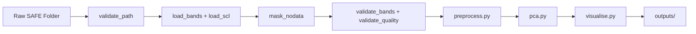

# DESIGN.md
## Sentinel-2 Brownfield Site Detection — Stoke-on-Trent
### Version 1.0 | Stoke City Council Planning Intelligence Tool

---

## 1. Requirements

This system is for the Stoke-on-Trent city council planning authority to help identify potential brownfield sites for further exploration. The system takes in raw data from the Copernicus Data Space Ecosystem, the satellite Sentinel-2 L2A carries a Multispectral Instrument (MSI) with 13 spectral bands. The data files input into the system are  Sentinel-2 L2A SAFE folder containing JP2 band files at 10m, 20m and 60m resolution. The bands used to investigate potential brownfield sites are bands 02, 03, 04, 05, 06, 07, 08, 8A, 11 and 12, these bands will be processed at 20m, the 10m bands will be down sampled to 20m. The system uses PCA spectral analysis to identify brownfield spectral signatures and outputs a report for the user. The report uses a false colour map and a results report to highlight candidate brownfield sites.  The scope of the system is for candidate identification purposes and will need follow up investigation. Version 2 looks to expand the system with geographic validation, Bare Soil Index preprocessing and change detection.

**Version 1 Reproducibility Constraint:**
Version 1 is designed to produce reproducible results using a single specific Sentinel-2 image:
- Date: 2026-05-25
- Sensing time: 11:06:21 UTC
- Tile: T30UWD
- Product: S2C_MSIL2A_20260525T110621_N0512_R137_T30UWD_20260525T144513.SAFE

Results are only guaranteed to be reproducible when using this exact image. Any other image — different date, different AOI, different tile — may produce different results. Users who wish to reproduce the results documented in this project must download the exact product listed above following the instructions in raw_data/README.md.

Generalisation to other images and locations is a Version 2 objective.

## 2. Problem Formulation

The system loads 10 spectral bands at 20m resolution and stacks them into a matrix where each row is a pixel and each column is a band. Before any analysis the data is centred by subtracting the mean of each band — this removes overall brightness differences between bands and ensures the covariance matrix measures variation not position. The system then computes the covariance matrix using the formula  $\Sigma = (1/n)X^TX$ , transposing the matrix onto itself creating a symmetric matrix.

The covariance matrix is then decomposed using the Spectral Theorem — $\Sigma = Q\Lambda Q^T$ — where Q contains the eigenvectors as columns and $\Lambda$ contains the eigenvalues on the diagonal. This is computed using numpy.linalg.eigh which is optimised for symmetric matrices and guarantees real eigenvalues and perpendicular eigenvectors. Each eigenvector represents a direction of spectral variation in the data and each eigenvalue represents how much variation exists in that direction.

Eigenvalues are then sorted by variance, this is so we can check which features have the biggest impact on the variation. The formula for each components variance is $\lambda_i / (\lambda_1 + \lambda_2 + \cdots + \lambda_n)$ the system will retain components that cumulatively explain 95% of variance. This threshold will be validated during implementation and adjusted if fewer or more components are needed to clearly distinguish brownfield spectral signatures. The chosen k is the point we meet the threshold. The data is then projected onto the top k eigenvectors using $X_{\text{reduced}} = X_{\text{centred}} \cdot Q[:,:k]$ - this transforms the original 10 band pixel matrix into a reduced representation capturing the most important spectral variation.

The system then normalises the first 3 principal components to the range of 0-255 and assigns them to the 3 colour channels of an image. The false colour map always uses the top 3 principal components regardless of k - as colour image has exactly 3 channels. Where k exceeds 3, the additional components contribute to the analysis but are not directly visualised. Matplotlib takes these 3 channels and renders them as a colour image. Pixels with similar spectral signatures get similar colours. Brownfield land will cluster into a similar colour, vegetation in to another, and urban fabric into another.

## 3. Architecture
### Project Structure
```
sentinel2-brownfield-stoke/
├── src/
│   ├── data.py          — Load and prepare band data
│   ├── validation.py    — All quality checks
│   ├── preprocess.py    — Centre data and build covariance matrix
│   ├── pca.py           — Spectral decomposition, choose k, project
│   ├── visualise.py     — False colour map and results report
│   └── main.py          — Pipeline orchestration
├── tests/
│   ├── __init__.py
│   ├── test_data.py
│   ├── test_validation.py
│   ├── test_preprocess.py
│   ├── test_pca.py
│   ├── test_visualise.py
│   └── test_main.py
├── notebooks/
│   └── 01_data_inspection.ipynb
├── data/                — Reference datasets committed to GitHub
│   ├── README.md
│   ├── brownfield_register_2019.csv
│   ├── brownfield_register_2020.csv
│   ├── brownfield_register_2021.csv
│   ├── brownfield_register_2022.xlsx
│   ├── brownfield_register_2023.csv
│   ├── brownfield_register_2024.csv
│   ├── contaminated_land_register.pdf
│   ├── contaminated_land_special_sites.csv
│   └── uk_local_authority_boundaries.geojson
├── outputs/
├── raw_data/            — Sentinel-2 satellite imagery — not committed to GitHub
│   ├── README.md
│   └── S2C_MSIL2A_20260525T110621_N0512_R137_T30UWD_20260525T144513.SAFE/  — see README.md to download
├── DESIGN.md
├── EDA.md
├── README.md
└── requirements.txt
```
### Pipeline Flow



### Module: data.py — Load and Prepare Band Data

| Function | Input | Output | Purpose |
|---|---|---|---|
| _arrange_band_array | loaded_bands: list | np.ndarray (pixels, n_bands) | stacks list of 2D band arrays, tranposes to correct axis order, reshapes to (pixels, n_bands) |
| load_bands | safe_path: str | np.ndarray (pixels, 10) | Loads 10 selected bands at 20m, downsamples 10m bands |
| load_scl | safe_path: str | np.ndarray (5490, 5490) | Loads SCL_20m.jp2 for nodata masking  |
| mask_nodata | band_array: np.ndarray, scl_array: np.ndarray = None | tuple — (np.ndarray (valid_pixels, 10), np.ndarray or None (pixels,), tuple or None) | Removes pixels where SCL class = 0 (nodata) or SCL class = 1 (defective/saturated). Returns the filtered array, the boolean mask used, and the original 2D shape — needed by false_map_creation to reconstruct the image. If scl_array is None, masking is skipped and mask/original_shape are returned as None |
>**Note:** load_scl is specific to Sentinel-2 L2A products. Future versions supporting other satellite products will require a different masking approach.

### Module: validation.py - All Quality Checks
| Function | Input | Output | Purpose |
|---|---|---|---|
| validate_path | safe_path: str | safe_path: str | Validates SAFE folder exists, raises FileNotFoundError if not |
| validate_bands | band_array: np.ndarray | bool | Checks array is 2D, number of columns matches bands selected, no negative values, no corrupt rows — raises ValueError if invalid |
| validate_quality | scl_array: np.ndarray, cloud_threshold: float = 0.10 | bool | Checks cloud cover does not exceed threshold - raises ValueError if image quality insufficient |

### Module: preprocess.py — Centre Data and Build Covariance Matrix

| Function | Input | Output | Purpose |
|---|---|---|---|
| centre_data | band_array: np.ndarray (pixels, 10) | centred_array: np.ndarray (pixels, 10) | Subtracts column mean from each band - centres data around zero |
| compute_covariance | centred_array: np.ndarray (pixels, 10) | covariance_matrix: np.ndarray (10, 10) | Computes $\Sigma = (1/n)X^TX$ — produces symmetric matrix for spectral decomposition |

### Module: pca.py — Spectral Decomposition, Choose k, Project

| Function | Input | Output | Purpose |
|---|---|---|---|
| spectral_decomposition | covariance_matrix: np.ndarray (10, 10) | eigenvalues: np.ndarray (10,), eigenvectors: np.ndarray (10, 10) | Decomposes covariance matrix using numpy.linalg.eigh - returns real eigenvalues and perpendicular eigenvectors |
| sort_variance | eigenvalues: np.ndarray (10,), eigenvectors: np.ndarray (10, 10) | sorted_eigenvalues: np.ndarray (10,), sorted_eigenvectors: np.ndarray (10, 10) | Sorts eigenvalues largest to smallest, reorders eigenvectors to match |
| cumulative_variance_for_k | sorted_eigenvalues: np.ndarray (10, ), variance_threshold: float = 0.95  | k: int | Calculates cumulative variance explained, returns k components needed to reach variance_threshold |
| project | centred_array: np.ndarray (pixels, 10), eigenvectors: np.ndarray (10, 10), k: int | X_reduced: np.ndarray (pixels, k) | Projects centred data onto top k eigenvectors using $X_{\text{reduced}} = X_{\text{centred}} \cdot Q[:,:k]$ |

### Module: visualise.py — False Colour Map and Results Report
| Function | Input | Output | Purpose |
|---|---|---|---|
| convert_k_to_rgb | X_reduced: np.ndarray (pixels, k) | rgb_array: np.ndarray (pixels, 3) | Takes top 3 principal components and normalises to 0-255 range for RGB colour channels. Raises ValueError if fewer than 3 components, empty array, or a component has zero variance |
| false_map_creation | rgb_array: np.ndarray (pixels, 3), output_dir: str, mask: np.ndarray = None, original_shape: tuple = None | None — saves false_colour_map_YYYYMMDD_HHMMSS.png to outputs/ | Reconstructs the full 2D image by placing valid pixels back into their original positions using mask and original_shape, with masked-out pixels rendered as black. If mask or original_shape is None, falls back to

### Module: main.py — Pipeline Orchestration

| Function | Input | Output | Purpose |
|---|---|---|---|
| run_pipeline | safe_path: str | None — saves outputs to outputs/ folder | Orchestrates the full pipeline — calls validate_path, load_bands, load_scl, mask_nodata, validate_bands, validate_quality, centre_data, compute_covariance, spectral_decomposition, sort_variance, cumulative_variance_for_k, project, convert_k_to_rgb, false_map_creation, report_creation in sequence |

## 4. Risks

The system carries several risks that planning officials and future developers should be aware of.

The most significant risk is that the system has no geographic validation in Version 1. It will process any valid Sentinel-2 L2A SAFE folder regardless of location. A user who downloads an image covering the wrong area will receive a false colour map and report with no warning that the results are not relevant to Stoke-on-Trent. To mitigate this in Version 1 the correct download instructions are documented in raw_data/README.md. Geographic validation and AOI clipping will be added in Version 2. This is a known Version 1 constraint — the system is designed to reproduce results from a single specific image documented in Section 1. Generalisation to other images is a Version 2 objective.

Seasonal variation presents a second risk. The system was developed and tested using a May 2026 summer image captured during a heatwave with minimal cloud cover. Spectral signatures change significantly between seasons — winter imagery may contain snow or ice which has a similar spectral signature to bare soil and could be misclassified as brownfield land. Wet soils in autumn and winter also produce different spectral responses. Users should download summer imagery where possible and be cautious interpreting results from winter images.

The system may also experience spectral confusion between land cover types. Two different surfaces with similar spectral signatures in the selected bands may cluster together in the PCA and appear as the same colour on the false colour map. For example brownfield bare soil and agricultural bare soil may be indistinguishable. This is a fundamental limitation of unsupervised PCA — the system identifies spectral variation but cannot label land cover types with certainty. All outputs should be treated as candidate sites requiring physical verification.

Brownfield sites in Stoke-on-Trent may be contaminated with heavy metals, coal tar or asbestos from former pottery, mining and steelworks industries. The system cannot distinguish between clean brownfield and contaminated brownfield — both produce similar spectral signatures. Candidate sites identified by this tool must be cross-referenced against the Environment Agency contaminated land register before any planning decision is made.

Missing or corrupted band files present a technical risk. If the downloaded SAFE folder is missing any of the 10 required bands the pipeline will raise a ValueError from validate_bands before processing begins. Users should ensure the complete SAFE folder has been downloaded and extracted correctly.

Finally the system was developed and validated against a single image. Results on different dates, different atmospheric conditions, or different seasonal contexts have not been tested. The 95% variance threshold and band selection were chosen based on this single image and may require adjustment for other dates or conditions.

## 5. Success Criteria

The pipeline is considered successful when all of the following conditions are met.

The outputs folder contains two timestamped files after a successful run — a false colour map saved as false_colour_map_YYYYMMDD_HHMMSS.png and a results report saved as results_report_YYYYMMDD_HHMMSS.md. If either file is missing the pipeline has not completed successfully.

The PCA pipeline is considered correct when all unit tests pass. Each of the six modules has at least one test per function — a minimum of 15 tests covering data loading, validation, preprocessing, decomposition, projection and visualisation. Edge cases including missing bands, corrupt arrays and excessive cloud cover must also be tested. The full test suite must pass with zero failures before the pipeline is considered production ready.

The false colour map is considered useful when it visually distinguishes at least three land cover types — brownfield bare soil, vegetation and urban fabric — as clearly different colours. Water bodies such as the River Trent should also appear as a distinct colour. The map should be interpretable by a planning official without data science knowledge.

The results report is considered complete when it contains the number of principal components retained, the variance explained by each component, and a plain English summary of the findings suitable for a non-technical planning official.

All pipeline runs must complete within a reasonable time — target under 5 minutes on a standard laptop for the full Stoke-on-Trent dataset.

Candidate sites identified by the false colour map should be cross-referenced against data/brownfield_register.csv to identify overlap with known registered sites and highlight potential unregistered brownfield land.

## 6. Future Versions

| Version | Enhancement | Notes |
|---|---|---|
| v2 | Geographic validation and AOI clipping | System clips any downloaded image to a fixed Stoke-on-Trent bounding box — results consistent regardless of user AOI |
| v2 | Bare Soil Index preprocessing | Calculate BSI prior to PCA — filters obvious non-brownfield pixels, provides independent validation of PCA results. BSI threshold must be calibrated for Stoke-on-Trent soil conditions and validated against the council brownfield register |
| v2 | Brownfield register validation | Cross-reference candidate sites against Stoke-on-Trent brownfield register coordinates — identifies overlap between PCA candidates and known registered sites, highlights potential unregistered sites |
| v2 | Change detection | Compare two Sentinel-2 images from different dates — identifies newly appearing brownfield sites and sites that have been developed since previous analysis. Supports annual brownfield register update process |
| v3 | Streamlit web interface | Planning officials access via browser — no command line required — upload or trigger download, receive map and report |
| v3 | Supervised classification using brownfield register | Train Random Forest or SVM on Stoke-on-Trent brownfield register coordinates as ground truth labels — moves from candidate identification to validated probabilistic classification |
| v3 | Contamination filtering | Cross-reference candidate sites against Environment Agency contaminated land register — exclude known contaminated sites. Explore supervised detection of contamination spectral signatures using Sentinel-2 SWIR bands |
| v3 | Temporal spectral training data | Extract spectral signatures from historical Sentinel-2 images of known brownfield sites before development — creates verified before/after training pairs. Improves supervised classifier accuracy by distinguishing active brownfield from developed former brownfield |
| v4 | Multi-city expansion | Generalise pipeline to other UK cities using automated Copernicus API download — BSI thresholds and classifier retrained per city using local brownfield register data |

### Design Decisions for Future Versions

- validate_bands uses dynamic shape checking — not hardcoded to 10 bands — supports different band selections in future versions and multi-city expansion
- validate_quality cloud_threshold is configurable — default 0.10 — overridable for different seasonal conditions and geographic regions
- cumulative_variance_for_k variance_threshold is configurable — default 0.95 — may require adjustment for different cities or seasonal imagery
- validation.py is a separate module — new quality checks can be added without touching data.py — designed for extensibility
- mask_nodata scl_array is optional — defaults to None — supports future versions where SCL may not be available or where a different masking approach is used
- load_scl is specific to Sentinel-2 L2A — future versions supporting other satellite products or other cities will require a different masking approach
- Output files are timestamped — prevents overwriting on multiple runs — essential for change detection in Version 2 where multiple dated images will be compared
- Geographic validation removed from Version 1 — validate_aoi will be implemented in Version 2 using verified ONS boundary data for Stoke-on-Trent
- BSI threshold calibration deferred to Version 2 — requires validation against Stoke-on-Trent specific soil conditions and council brownfield register
- Temporal analysis deferred to Version 3 — requires historical Sentinel-2 imagery pipeline and before/after training pair extraction
- Multi-city expansion deferred to Version 4 — requires per-city BSI calibration, classifier retraining and automated API download