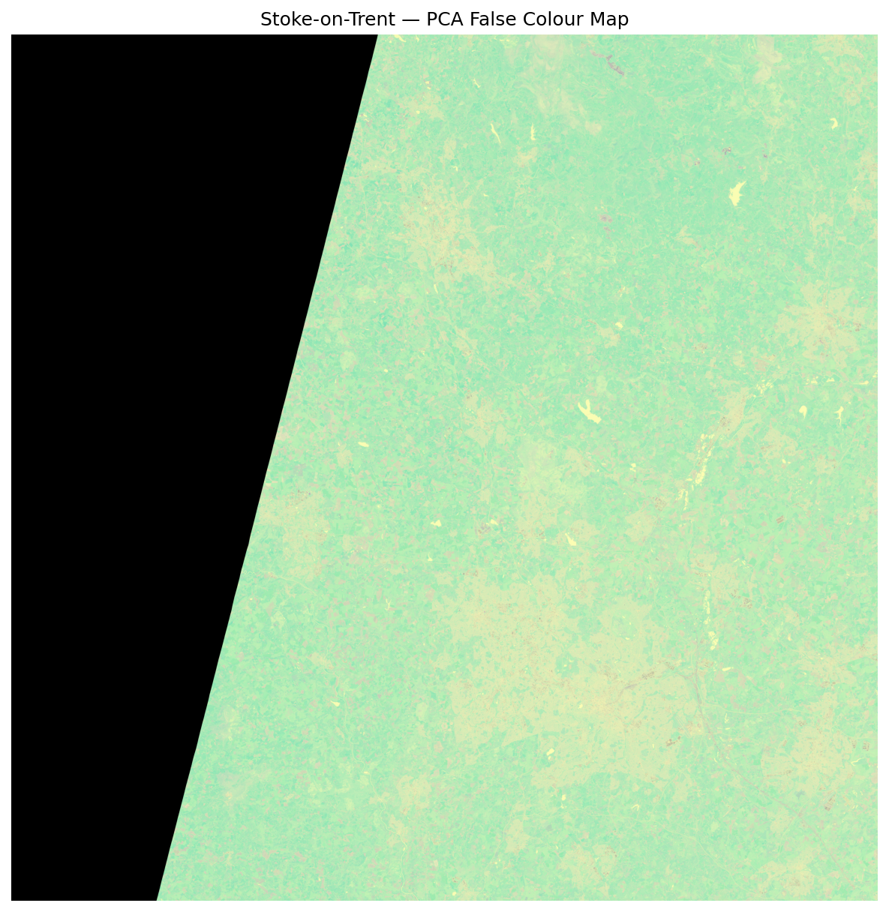
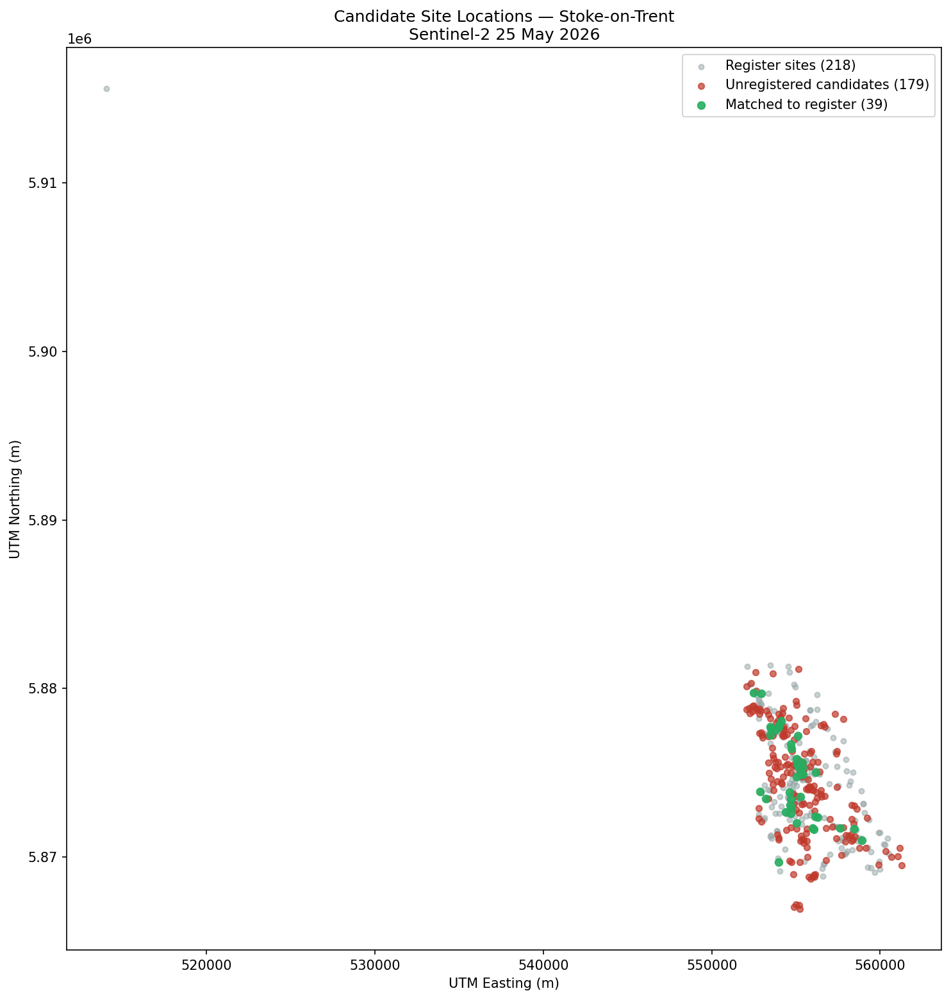
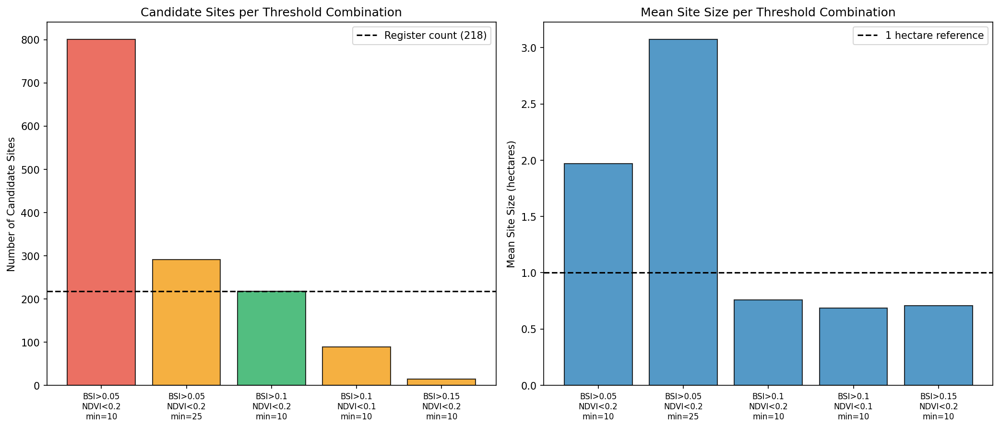

# Sentinel-2 Brownfield Site Detection
### Brownfield Detection Pipeline — Stoke-on-Trent Planning Intelligence Tool


A satellite-based system for identifying potential brownfield land in Stoke-on-Trent using free Sentinel-2 imagery from the Copernicus Data Space Ecosystem. The system automatically downloads satellite images, applies spectral analysis to identify candidate brownfield sites, filters non-brownfield land use, cross-references candidates against the council's brownfield register, and produces an interactive map and PDF report for planning officials.

No commercial tool currently identifies *unregistered* brownfield land from satellite imagery. This system fills that gap.

---

## What It Does

1. **Downloads satellite imagery automatically** — authenticates with the Copernicus API and downloads Sentinel-2 L2A SAFE files for any UK council by GSS code and date
2. **Applies AOI clipping** — clips the satellite image to the council boundary retrieved from PostgreSQL, reducing 21 million pixels to ~233,000 for Stoke-on-Trent
3. **Computes spectral indices** — calculates Bare Soil Index (BSI) and Normalised Difference Vegetation Index (NDVI) across all valid pixels after normalising raw digital numbers to surface reflectance
4. **Applies PCA spectral decomposition** — reduces 10 spectral bands to the most significant components
5. **Detects candidate sites** — applies BSI>0.1 and NDVI<0.2 thresholds to identify bare soil candidate pixels, then uses connected-component analysis to group spatially adjacent candidates into discrete sites with valid footprint polygons
6. **Filters non-brownfield land use** — drops candidates majority-inside land-use classes disjoint from brownfield (car parks, quarries, agriculture, amenity/leisure), computed as indexed PostGIS area-overlap against OpenStreetMap polygons, and reports the register recall guardrail every run
7. **Optionally requires temporal persistence** — candidates must recur near the same location on prior image dates (`--min_persistence`)
8. **Cross-references the brownfield register** — compares candidate sites against the brownfield register stored in PostgreSQL using 100m proximity matching
9. **Produces professional outputs** — interactive Folium map, PDF report and false colour map
10. **Stores results in database** — candidate sites (with footprint geometry) and pipeline run metadata stored in PostgreSQL for historical comparison and evaluation

---

## Version 2 Results — Stoke-on-Trent, 25 May 2026

### Pipeline Performance
- **21,223,650** valid pixels in full Sentinel-2 tile
- **233,603** pixels after AOI clipping to Stoke boundary (1.1% of tile)
- **1,951** brownfield candidate pixels (BSI>0.1, NDVI<0.2)
- **218** candidate sites after connected-component analysis and size filtering
- **39** sites matched to the 2024 brownfield register (17.9% recall)
- **179** potential unregistered brownfield sites identified

### Detection Quality Status
A July 2026 labelling pilot found the raw unregistered candidates are dominated by land-use false positives, and a July 2026 math/algorithm audit identified correctness fixes to detection itself. The Detection Correctness Foundation workstream (FND-1 to FND-6) plus the exclusion filter, temporal persistence and the evaluation harness address this; precision and recall for the corrected pipeline are measured by `src/evaluation.py` rather than quoted from the raw Version 2 run above. A live Stoke measurement drove one key design decision: building and infrastructure land use are NOT hard exclusions, because 70 and 32 registered brownfield sites respectively fall inside them — registered brownfield IS previously-developed land. Those classes return as classifier features in the planned supervised model.

### False Colour Map


### Candidate Site Locations


### Threshold Calibration


### Why 17.9% Recall?
Registered brownfield sites in Stoke have a mean BSI of 0.005 and NDVI of 0.21 — meaning they are predominantly vegetated at the time of the May 2026 image. The BSI/NDVI threshold approach detects only currently bare land. The 39 matched sites are registered brownfield that happen to be bare in May 2026. The unregistered candidates are bare soil sites not appearing on any register — the primary finding of the system.

The Version 3 supervised Random Forest classifier will be trained on all 218 registered sites including vegetated ones, dramatically improving recall.

---

## Project Status

| Version | Status | Description |
|---|---|---|
| v1 | ✅ Complete | PCA spectral analysis, false colour map, results report |
| v2 | ✅ Complete | Database, Copernicus API, BSI/NDVI clustering, interactive map, PDF report |
| v3 | Planned | Supervised Random Forest classifier, Streamlit web interface, Supabase migration |
| v4 | Planned | UK-wide multi-council expansion, automated scheduling |

---

## Competitive Context

Nimbus Maps, LandTech/LandInsight and SearchLand all overlay the existing brownfield register on a map — they show what is already known. This system identifies brownfield land that does not appear on any register, using satellite spectral analysis. The Alan Turing Institute's DemoLand project validated this approach for Newcastle but was never commercialised. No commercial tool currently performs satellite-based unregistered brownfield detection.

---

## Data Sources

| Dataset | Source | Notes |
|---|---|---|
| Sentinel-2 L2A imagery | Copernicus Data Space Ecosystem | Free, downloaded automatically via API |
| Brownfield register (manual) | DLUHC / data.gov.uk | Annual publication, 218 sites for Stoke-on-Trent 2019-2024 |
| Brownfield register (automated) | planning.data.gov.uk API | 352 Stoke sites, 85% UK council coverage |
| UK council boundaries | ONS Open Geography Portal | 361 local authorities, stored in PostgreSQL |
| Land-use exclusion polygons | OpenStreetMap (Overpass API) | Buildings, car parks, amenity/leisure, infrastructure, quarries, agriculture. Licensed under ODbL — see P4-8 licensing review; OS OpenData is the licence-clean fallback for building footprints |

---

## Setup

### Prerequisites
- Python 3.11+
- PostgreSQL 16 with PostGIS 3.5 (install via Chocolatey on Windows: `choco install postgresql16`)
- A Copernicus Data Space Ecosystem account (free at https://dataspace.copernicus.eu)

### Installation

```bash
git clone https://github.com/LukeWardle/sentinel2-brownfield-stoke
cd sentinel2-brownfield-stoke
python -m venv venv
venv\Scripts\activate  # Windows
pip install -r requirements.txt
```

### Configuration

Copy the template and fill in your values (never commit `.env`):

```bash
cp .env.example .env
```

Set two things in `.env`:
- `COPERNICUS_USERNAME` and `COPERNICUS_PASSWORD` — your Copernicus Data Space account
- `DATABASE_URL` — a single libpq connection string (local Postgres or Supabase). Percent-encode special characters in the password, e.g. `!` → `%21`. See `.env.example` for the Supabase format.

### Pre-commit hooks

This repo runs pre-commit to scan for secrets (gitleaks) and enforce
formatting (ruff, black) before every commit. After cloning:

    pip install pre-commit
    pre-commit install

Hooks then run automatically on `git commit`. Run them across all files
manually with: `pre-commit run --all-files`.

### Database Setup

Create the database and enable PostGIS:

```sql
CREATE DATABASE sentinel2_brownfield;
\c sentinel2_brownfield
CREATE EXTENSION postgis;
```

Apply the schema migrations in order:

```bash
psql -U postgres -d sentinel2_brownfield -f migrations/001_initial_schema.sql
psql -U postgres -d sentinel2_brownfield -f migrations/002_exclusion_zones.sql
psql -U postgres -d sentinel2_brownfield -f migrations/003_candidate_geometry.sql
```

Load reference data (one-time setup):

```bash
python scripts/setup_boundaries.py
python scripts/setup_brownfield.py
```

Optionally download latest brownfield data from planning.data.gov.uk:

```bash
python scripts/download_brownfield_registers.py E06000021
```

Load OpenStreetMap land-use exclusion zones for a council (re-runnable; replaces existing rows per class):

```bash
python scripts/setup_exclusions.py E06000021
```

---

## Running the Pipeline

```bash
python src/main.py --gss_code E06000021 --date 2026-05-25
```

The pipeline accepts any UK council GSS code and image date. It downloads the relevant Sentinel-2 image automatically, processes it, and produces outputs in `outputs/`.

To require candidates to persist across image dates (needs at least one prior stored run on a different date for the council):

```bash
python src/main.py --gss_code E06000021 --date 2026-06-14 --min_persistence 1
```

---

## Evaluation

Register recall (fraction of register sites detected by the latest run) is computed against the brownfield register, which serves as the pipeline's standing validation set:

```bash
python -m src.evaluation --gss_code E06000021
```

Precision requires manual labels. Export the latest run's unregistered candidates to a labelling sheet, label each row per `docs/labelling_protocol.md`, then evaluate:

```bash
python scripts/export_labelling_sheet.py E06000021
# ... fill the label column in the exported CSV ...
python -m src.evaluation --gss_code E06000021 --labels outputs/labelling_sheet_E06000021_<stamp>.csv
```

---

## Outputs

Each pipeline run produces three timestamped files in `outputs/`:

- `false_colour_map_YYYYMMDD_HHMMSS.png` — PCA false colour map
- `results_report_YYYYMMDD_HHMMSS.pdf` — Professional PDF report for planning officials
- `interactive_map_GSSCODE_YYYYMMDD_HHMMSS.html` — Interactive Folium map of candidate sites

Results are also stored in PostgreSQL:
- `candidate_sites` table — all detected sites with coordinates, footprint geometry, size and register match status
- `pipeline_runs` table — run metadata and summary statistics

---

## Running Tests

```bash
python -m pytest tests/ -v
```

Comprehensive test suite run automatically in CI on every push and pull request (see the tests workflow).

---

## EDA Notebooks

| Notebook | Description |
|---|---|
| 01_data_inspection_eda.ipynb | Initial Sentinel-2 data inspection |
| 02_brownfield_register_eda.ipynb | Brownfield register analysis |
| 03_boundary_file_eda.ipynb | UK council boundary file analysis |
| 04_bsi_ndvi_calibration_eda.ipynb | BSI and NDVI calibration — critical finding that registered sites are vegetated |
| 05_clustering_calibration_eda.ipynb | Clustering algorithm design and threshold calibration |
| 06_pipeline_results_validation.ipynb | Version 2 pipeline results validation and analysis |

---

## Documentation

- [DESIGN.md](DESIGN.md) — Full architecture, module design and Version roadmap
- [DATABASE.md](DATABASE.md) — PostgreSQL/PostGIS schema design and migration path
- [EDA.md](EDA.md) — Exploratory data analysis findings
- [data/README.md](data/README.md) — Data source download instructions

---

## Licence

MIT Licence — see LICENSE file for details.
