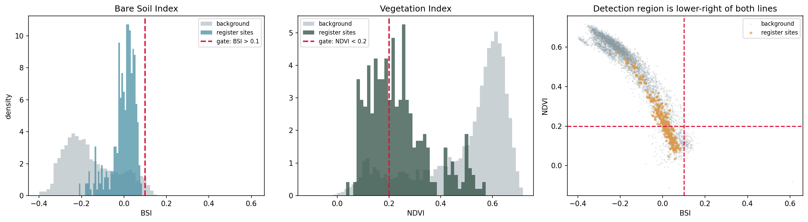

# Sentinel-2 Brownfield Site Detection

### A satellite detection pipeline for Stoke-on-Trent, and the reason it does not work


A production pipeline which downloads Sentinel-2 L2A imagery from the Copernicus Data Space Ecosystem, clips it to a UK council boundary, computes spectral indices, clusters bare-ground pixels into candidate sites, filters them against land-use polygons, and stores the results with footprint geometry in PostGIS. It was built to identify unregistered brownfield land in Stoke-on-Trent.

**It does not detect brownfield land. This repository documents the investigation that established why.**

---

## The finding

Registered brownfield land in Stoke-on-Trent is vegetated. Sampled directly at all 352 register locations rather than inferred from detector output, it has a mean NDVI of 0.234 and a mean BSI of −0.003. The detector's gate requires BSI above 0.1 and NDVI below 0.2.

**Zero of 352 register sites satisfy both conditions. Zero satisfy the BSI condition alone.** The highest BSI recorded anywhere in the register is 0.0843, below the threshold.



Recall against the register is therefore not low, it is structurally zero. Figures of 17.9% and 15.3–23.1% reported earlier in this project are artefacts of a 100 metre proximity match which credits a candidate with detecting a site it does not occupy. Tightening that radius reduces matches from 105 sites to 45 at 50 metres and 16 at 25 metres — a rate of collapse consistent with coincidental proximity in a dense urban area — and the median distance from a register site to the nearest candidate is 154 metres.

Two independent labelling exercises confirm the consequence. Nineteen unregistered candidates from a single date, and a further nineteen surviving a four-season persistence filter, were inspected individually against aerial imagery. **All thirty-eight were false positives**: active industrial premises, hospital and school hardstanding, distribution loading yards, a stadium car park, an active construction site, and one scheduled monument.

The mechanism is that bare ground and previously developed land are close to disjoint populations in a city. Derelict land is colonised by vegetation within a season or two of abandonment. What remains reliably bare across every season is hardstanding *maintained* in that condition because it is in continuous use. The detector finds roofs and yards, which is what persistently bare ground in an urban area actually is. The mechanism is not particular to Stoke. [Preston et al. (2023)](https://doi.org/10.1016/j.landurbplan.2022.104590), assessing brownfield across Greater Manchester, found that 51% of brownfield land is vegetated, and that the sites hardest to develop are among the most vegetated of all — a bare-soil detector is therefore selecting against precisely the land the register is most concerned with.

The measurement was available from the outset. Notebook 04 recorded a mean BSI of 0.005 at register sites in May 2026, three paragraphs from the section setting the gate threshold at 0.1. The two numbers were never compared, and three subsequent notebooks proceeded on the assumption that the detector partially reached the register and could be improved.

Full analysis: [`notebooks/09_register_characterisation.ipynb`](notebooks/09_register_characterisation.ipynb).

---

## What the system does

1. **Downloads satellite imagery** — authenticates with the Copernicus API and retrieves Sentinel-2 L2A SAFE files for any UK council by GSS code and date, with token refresh across long downloads
2. **Clips to the council boundary** — retrieved from PostGIS, reducing 21 million tile pixels to ~233,000 for Stoke
3. **Masks cloud and nodata** — SCL-based filtering, flattening to a `(valid_pixels, 10)` array
4. **Computes spectral indices** — BSI, NDVI and NDBSI after normalising raw digital numbers to surface reflectance
5. **Detects candidate sites** — threshold gate followed by connected-component clustering, with boundaries traced via `rasterio.features.shapes`
6. **Filters land use** — drops candidates majority-inside classes disjoint from brownfield (car parks, quarries, agriculture, amenity/leisure) via indexed PostGIS area-overlap against OpenStreetMap polygons
7. **Optionally requires temporal persistence** — candidates must recur near the same location on prior dates (`--min_persistence`)
8. **Matches the register** — 100 metre proximity matching. *This is the defect described above; a polygon-containment test should replace it now that candidate geometry is persisted*
9. **Produces outputs** — interactive Folium map, PDF report, false-colour map
10. **Stores results** — candidates with footprint geometry, features and run metadata in PostgreSQL

---

## Pipeline performance — Stoke-on-Trent

Measured over four seasonal scenes: 9 July 2026, 22 September 2025, 26 December 2025 and 25 May 2026.

| Metric | Value |
|---|---|
| Valid pixels in full tile | 21,223,650 |
| Pixels after AOI clipping | 233,603 (1.1% of tile) |
| Candidate pixel share by season | 2.8% Jul · 1.7% Sep · 1.0% Dec · 0.8% May |
| Candidate sites per scene | 251 Jul · 153 Sep · 72 Dec · 78 May |
| Candidates bare across all four dates | 20 (19 unregistered) |
| Sellable sites among those 19 | **0** |
| Register recall at 25 m matching | 16 of 352 (4.5%) |
| Register sites passing the detection gate | **0 of 352** |

The seasonal gradient is physically coherent: bare-soil signal peaks in midsummer and declines through autumn into winter as illumination falls and vegetation senesces. The engineering works. The target is not in what it finds.

### Why persistence made it worse

Requiring bareness across four seasons removed 26 of 72 winter candidates as transient — ploughed ground, temporary works — which is the behaviour the filter was designed to produce. But persistence selects for *permanence of use*, not absence of it. A depot yard is bare in every season precisely because it is maintained. Derelict land greens over and is excluded. The filter selects against the target.

---

## The app

A three-page Streamlit app presenting the investigation and this result for a
non-technical reader. **Pipeline** — what the system does, the four seasonal
scenes and the seasonal gradient. **Map** — the twenty persistent candidates as
traced footprints over aerial imagery, coloured by what each turned out to be,
with the register overlaid for comparison. **Finding** — the register against the
gate, the 0 of 352 result and the mechanism.

```bash
pip install -r app/requirements.txt
streamlit run app/streamlit_app.py
```

It reads committed files under `data/app/` and opens no database connection, so
it runs from a bare checkout and deploys to Streamlit Community Cloud unchanged —
set the main file path to `app/streamlit_app.py`, and Cloud installs
`app/requirements.txt` in preference to the root `requirements.txt` because it
searches the entrypoint's directory first. No secrets are required.

Regenerating those files does need a database, and the two gate-sample exports
additionally need the May 2026 SAFE scene under `raw_data/`:

```bash
python scripts/export_app_data.py
```

See [`data/app/README.md`](data/app/README.md) for what each file holds and the
two traps in reading it. `tests/test_app_data.py` and
`tests/test_streamlit_app.py` check the exports and render every page with
`DATABASE_URL` removed from the environment.

---

## Project status

| Version | Status | Description |
|---|---|---|
| v1 | Complete | PCA spectral analysis, false colour map, results report |
| v2 | Complete | Database, Copernicus API, BSI/NDVI clustering, interactive map, PDF report |
| v3 | Halted | Supervised classifier. Code shipped (`src/model_train.py`) but never trained: the candidate pool contains no positive examples |
| v4 | Not started | UK-wide expansion. Not pursued — scaling a method that does not work at one council is not worthwhile |

---

## What would be required instead

The literature indicates this is a known unsolved problem rather than an implementation failure. [Xu & Ehlers (2022)](https://doi.org/10.1016/j.compenvurbsys.2021.101729) abandoned image classification for rule-based data fusion across 63 German districts, reporting that automatic detection of vacant land as a class — of which brownfield is one of four categories in their typology — remains difficult even where commercial high-resolution imagery is used. [Sun et al. (2023)](https://doi.org/10.3390/ijgi12100409) find vacant industrial land difficult to distinguish from operational industrial land on image features alone, and resolve it by adding land surface temperature and population density as non-image filters.

Three directions follow, none of which is a modification of this pipeline:

- **Non-image occupancy data.** UK business rates identify occupied hereditaments, and empty-property relief functions as a vacancy register. This is the active-versus-abandoned signal imagery cannot supply.
- **Multi-year phenology.** Abandonment detection by NDVI trajectory reaches the high 80s in the cropland literature — non-abandoned land shows cyclical annual NDVI, abandoned land a rising trend under succession. This requires years of Landsat at 30 m, which is coarse against a median register site of 0.28 ha.
- **A different target.** Change detection on *known* geometries — monitoring permitted sites for build-out — is what satellites are reliably good at, and has free ground truth in planning records. It reuses the ingest, clipping, masking, storage and matching layers unchanged.

---

## Competitive context

Nimbus Maps, LandTech/LandInsight and SearchLand aggregate ownership, planning history, constraints and comparables; LandInsight additionally filters sites by state (in use, vacant, demolished) from business-rates data. None are known to use satellite detection of unregistered land. Whether that absence represented an opportunity or a signal was an open question when this project began. The evidence here supports the latter reading.

---

## Data sources

| Dataset | Source | Notes |
|---|---|---|
| Sentinel-2 L2A imagery | Copernicus Data Space Ecosystem | Free, downloaded automatically via API |
| Brownfield register | planning.data.gov.uk API | 352 Stoke sites in the 2026 publication; 218 in the stable 2019–2024 releases |
| UK council boundaries | ONS Open Geography Portal | 361 local authorities, stored in PostgreSQL |
| Land-use exclusion polygons | OpenStreetMap (Overpass API) | Car parks, amenity/leisure, quarries, agriculture. ODbL licensed — OS OpenData is the licence-clean fallback |

Building and infrastructure land use are deliberately **not** hard exclusions: 70 and 32 registered sites respectively fall inside them, because registered brownfield *is* previously developed land. The distinction needed is active versus abandoned, which land-use class alone does not supply.

---

## Setup

### Prerequisites
- Python 3.11+
- PostgreSQL 16 with PostGIS 3.5
- A Copernicus Data Space Ecosystem account (free at https://dataspace.copernicus.eu)

### Installation

```bash
git clone https://github.com/LukeWardle/sentinel2-brownfield-stoke
cd sentinel2-brownfield-stoke
python -m venv venv
venv\Scripts\activate  # Windows
pip install -r requirements.txt
```

### Configuration

```bash
cp .env.example .env
```

Set in `.env`:
- `COPERNICUS_USERNAME` and `COPERNICUS_PASSWORD`
- `DATABASE_URL` — a single libpq connection string. Percent-encode special characters in the password, e.g. `!` → `%21`

### Pre-commit hooks

```bash
pip install pre-commit
pre-commit install
```

Scans for secrets (gitleaks) and enforces formatting (ruff, black) on every commit. Run across all files with `pre-commit run --all-files`.

### Database

```sql
CREATE DATABASE sentinel2_brownfield;
\c sentinel2_brownfield
CREATE EXTENSION postgis;
```

Apply all migrations in order:

```bash
for f in migrations/*.sql; do psql -U postgres -d sentinel2_brownfield -f "$f"; done
```

Load reference data:

```bash
python scripts/setup_boundaries.py
python scripts/setup_brownfield.py
python scripts/setup_exclusions.py E06000021
```

---

## Running the pipeline

```bash
python -m src.main --gss_code E06000021 --date 2026-05-25
```

Accepts any UK council GSS code and image date. Downloads the scene, processes it, and writes outputs to `outputs/`.

Requiring persistence across dates (needs at least one prior stored run for the council on a different date):

```bash
python -m src.main --gss_code E06000021 --date 2026-07-09 --min_persistence 1
```

**Note on scene selection.** The OData `cloudCover` attribute is measured across the whole ~110 km tile, not the council area, so it selects the wrong scenes in both directions. Dates must be inspected visually in Copernicus Browser, judging cloud over the boundary specifically.

---

## Evaluation

```bash
python -m src.evaluation --gss_code E06000021 --report
```

Writes `outputs/metrics_<gss>_<timestamp>.json` and a PR-curve PNG.

Precision requires manual labels:

```bash
python scripts/export_labelling_sheet.py E06000021
# label each row per docs/labelling_protocol.md
python -m src.evaluation --gss_code E06000021 --labels outputs/labelling_sheet_<gss>_<stamp>.csv
```

Ground truth from the four-season labelling exercise is committed at `data/groundtruth/persistent_labels.csv` — 19 sites, 0 sellable.

**Register recall as reported by this harness uses 100 metre matching and overstates detection.** See the finding above.

---

## Testing

```bash
python -m pytest tests/ -v
```

439 tests, run in CI on every push and pull request. The app tests skip
themselves where `streamlit` is not installed.

---

## Notebooks

The investigation in order. Notebooks 04–08 carry correction blocks recording what was believed at the time and what later proved wrong; these are retained deliberately, since the sequence of corrections is part of the record.

| Notebook | Description |
|---|---|
| 01 | Initial Sentinel-2 data inspection |
| 02 | Brownfield register analysis |
| 03 | UK council boundary file analysis |
| 04 | BSI/NDVI calibration — records mean BSI 0.005 at register sites, the measurement whose significance was missed |
| 05 | Clustering design and threshold calibration |
| 06 | Version 2 pipeline validation — source of the 17.9% recall figure, since retracted |
| 07 | Classifier design — identifies the gate-ceiling problem architecturally |
| 08 | Persistence validation — four seasonal scenes, 19/19 non-sellable |
| 09 | Register characterisation — zero of 352 sites pass the gate |

---

## Documentation

- [DESIGN.md](DESIGN.md) — architecture, module design, decision log
- [DATABASE.md](DATABASE.md) — schema design and migration path
- [EDA.md](EDA.md) — exploratory findings

---

## Docker

```bash
docker compose up -d db
docker compose run pipeline python -m src.main --gss_code E06000021 --date 2026-05-25
```

`docker compose down -v` resets the database. Credentials come from `.env` and are never baked into the image.

## Dependency layout

- `requirements.txt` — runtime
- `requirements-dev.txt` — pytest, pre-commit, Jupyter, scikit-learn
- `requirements-ci.txt` — what CI installs

---

## References

P. D. Preston, R. M. Dunk, G. R. Smith and G. Cavan, 'Not all brownfields are equal: A typological assessment reveals hidden green space in the city', *Landscape and Urban Planning*, 229 (2023), 104590, https://doi.org/10.1016/j.landurbplan.2022.104590 [accessed 5 August 2026].

Y. Sun, H. Hu, Y. Han, Z. Wang and X. Zheng, 'Large-Scale Automatic Identification of Industrial Vacant Land', *ISPRS International Journal of Geo-Information*, 12:10 (2023), 409, https://doi.org/10.3390/ijgi12100409 [accessed 5 August 2026].

S. Xu and M. Ehlers, 'Automatic detection of urban vacant land: An open-source approach for sustainable cities', *Computers, Environment and Urban Systems*, 91 (2022), 101729, https://doi.org/10.1016/j.compenvurbsys.2021.101729 [accessed 5 August 2026].

---

## Licence

MIT — see LICENSE.
