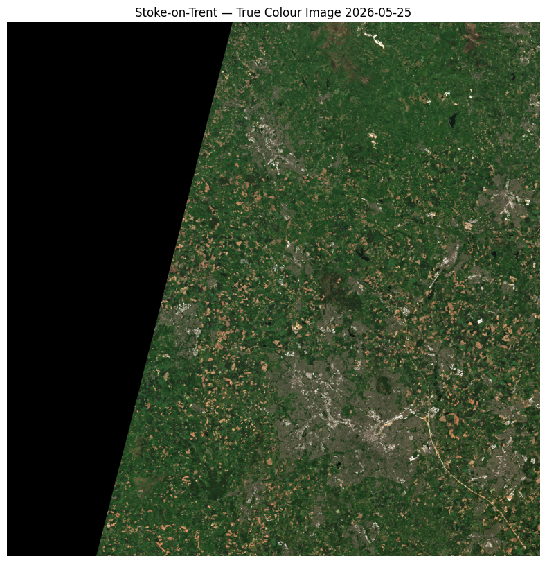
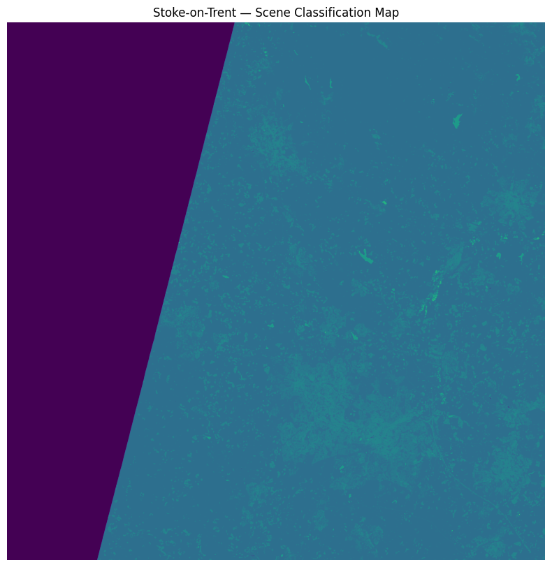

# Data Inspection - Sentinel-2 Brownfield Detection Stoke-on-Trent
This notebook investigates the structure, dimensions and pixel statistics of the Sentinel-2 L2A image captured on 25-05-2026 over Stoke-on-Trent.

## Objectives
- Confirm image dimensions and pixel count.
- Check pixel value ranges per band.
- Visually inspect the true colour image.
- Identify any data quality issues.


```python
import os
import sys
from pathlib import Path

import matplotlib.pyplot as plt
import numpy as np
import rasterio
```

## File Structure Investigation
Confirming the location and names of the band of files we will be working with.


```python
PROJECT_ROOT = Path(__file__).parent.parent if '__file__' in dir() else Path(os.getcwd()).parent
safe_path = str(PROJECT_ROOT / "raw_data" / "S2C_MSIL2A_20260525T110621_N0512_R137_T30UWD_20260525T144513.SAFE" / "S2C_MSIL2A_20260525T110621_N0512_R137_T30UWD_20260525T144513.SAFE")
print(safe_path)
```

    C:\Users\lward\workspace\sentinel2-brownfield-stoke\raw_data\S2C_MSIL2A_20260525T110621_N0512_R137_T30UWD_20260525T144513.SAFE\S2C_MSIL2A_20260525T110621_N0512_R137_T30UWD_20260525T144513.SAFE
    

**Note:** After extraction with 7-Zip the SAFE folder was nested inside itself. 
The correct data path requires navigating into the inner SAFE folder.


```python
contents = os.listdir(safe_path)
print(f"Number of items: {len(contents)}")
for item in contents:
    print(item)
```

    Number of items: 8
    DATASTRIP
    GRANULE
    HTML
    INSPIRE.xml
    manifest.safe
    MTD_MSIL2A.xml
    rep_info
    S2C_MSIL2A_20260525T110621_N0512_R137_T30UWD_20260525T144513-ql.jpg
    


```python
granule_path = os.path.join(safe_path, "GRANULE")
contents = os.listdir(granule_path)
for item in contents:
    print(item)
```

    L2A_T30UWD_A008973_20260525T111007
    


```python
granule_path = os.path.join(safe_path, "GRANULE")
granule_name = os.listdir(granule_path)[0]
img_data_path = os.path.join(granule_path, granule_name, "IMG_DATA")
contents = os.listdir(img_data_path)
for item in contents:
    print(item)
```

    R10m
    R20m
    R60m
    


```python
for resolution in contents:
    res_path = os.path.join(img_data_path, resolution)
    files = os.listdir(res_path)
    print(f"\n{resolution}:")
    for f in files:
        print(f"  {f}")
```

    
    R10m:
      T30UWD_20260525T110621_AOT_10m.jp2
      T30UWD_20260525T110621_B02_10m.jp2
      T30UWD_20260525T110621_B03_10m.jp2
      T30UWD_20260525T110621_B04_10m.jp2
      T30UWD_20260525T110621_B08_10m.jp2
      T30UWD_20260525T110621_TCI_10m.jp2
      T30UWD_20260525T110621_WVP_10m.jp2
    
    R20m:
      T30UWD_20260525T110621_AOT_20m.jp2
      T30UWD_20260525T110621_B01_20m.jp2
      T30UWD_20260525T110621_B02_20m.jp2
      T30UWD_20260525T110621_B03_20m.jp2
      T30UWD_20260525T110621_B04_20m.jp2
      T30UWD_20260525T110621_B05_20m.jp2
      T30UWD_20260525T110621_B06_20m.jp2
      T30UWD_20260525T110621_B07_20m.jp2
      T30UWD_20260525T110621_B11_20m.jp2
      T30UWD_20260525T110621_B12_20m.jp2
      T30UWD_20260525T110621_B8A_20m.jp2
      T30UWD_20260525T110621_SCL_20m.jp2
      T30UWD_20260525T110621_TCI_20m.jp2
      T30UWD_20260525T110621_WVP_20m.jp2
    
    R60m:
      T30UWD_20260525T110621_AOT_60m.jp2
      T30UWD_20260525T110621_B01_60m.jp2
      T30UWD_20260525T110621_B02_60m.jp2
      T30UWD_20260525T110621_B03_60m.jp2
      T30UWD_20260525T110621_B04_60m.jp2
      T30UWD_20260525T110621_B05_60m.jp2
      T30UWD_20260525T110621_B06_60m.jp2
      T30UWD_20260525T110621_B07_60m.jp2
      T30UWD_20260525T110621_B09_60m.jp2
      T30UWD_20260525T110621_B11_60m.jp2
      T30UWD_20260525T110621_B12_60m.jp2
      T30UWD_20260525T110621_B8A_60m.jp2
      T30UWD_20260525T110621_SCL_60m.jp2
      T30UWD_20260525T110621_TCI_60m.jp2
      T30UWD_20260525T110621_WVP_60m.jp2
    

## Finding: File Structure Confirmed
All expected band files are present across R10m, R20m and R60m folders.
B09 only available at 60m resolution.
B10 not present in this product.

## 2. Image Dimensions and Pixel Statistics
Checking dimensions and pixel value ranges for all JP2 files in R10m, R20m and R60m.

### 2a. R10m File Statistics
Checking dimensions and pixel value ranges for all JP2 files in R10m.


```python
r10m_path = os.path.join(img_data_path, "R10m")

for filename in os.listdir(r10m_path):
    if filename.endswith(".jp2"):
        filepath = os.path.join(r10m_path, filename)
        with rasterio.open(filepath) as src:
            data = src.read(1)
            print(f"File: {filename}")
            print(f"  Shape: {data.shape}")
            print(f"  Width: {src.width} pixels")
            print(f"  Height: {src.height} pixels")
            print(f"  Number of bands: {src.count}")
            print(f"  Coordinate system: {src.crs}")
            print(f"  Data type: {src.dtypes[0]}")
            print(f"  Min value: {data.min()}")
            print(f"  Max value: {data.max()}")
            print(f"  Mean value: {data.mean():.2f}")
            print()
```

    File: T30UWD_20260525T110621_AOT_10m.jp2
      Shape: (10980, 10980)
      Width: 10980 pixels
      Height: 10980 pixels
      Number of bands: 1
      Coordinate system: EPSG:32630
      Data type: uint16
      Min value: 0
      Max value: 180
      Mean value: 107.69
    
    File: T30UWD_20260525T110621_B02_10m.jp2
      Shape: (10980, 10980)
      Width: 10980 pixels
      Height: 10980 pixels
      Number of bands: 1
      Coordinate system: EPSG:32630
      Data type: uint16
      Min value: 0
      Max value: 20277
      Mean value: 1035.37
    
    File: T30UWD_20260525T110621_B03_10m.jp2
      Shape: (10980, 10980)
      Width: 10980 pixels
      Height: 10980 pixels
      Number of bands: 1
      Coordinate system: EPSG:32630
      Data type: uint16
      Min value: 0
      Max value: 19154
      Mean value: 1256.27
    
    File: T30UWD_20260525T110621_B04_10m.jp2
      Shape: (10980, 10980)
      Width: 10980 pixels
      Height: 10980 pixels
      Number of bands: 1
      Coordinate system: EPSG:32630
      Data type: uint16
      Min value: 0
      Max value: 18217
      Mean value: 1132.97
    
    File: T30UWD_20260525T110621_B08_10m.jp2
      Shape: (10980, 10980)
      Width: 10980 pixels
      Height: 10980 pixels
      Number of bands: 1
      Coordinate system: EPSG:32630
      Data type: uint16
      Min value: 0
      Max value: 17064
      Mean value: 3489.82
    
    File: T30UWD_20260525T110621_TCI_10m.jp2
      Shape: (10980, 10980)
      Width: 10980 pixels
      Height: 10980 pixels
      Number of bands: 3
      Coordinate system: EPSG:32630
      Data type: uint8
      Min value: 0
      Max value: 255
      Mean value: 43.64
    
    File: T30UWD_20260525T110621_WVP_10m.jp2
      Shape: (10980, 10980)
      Width: 10980 pixels
      Height: 10980 pixels
      Number of bands: 1
      Coordinate system: EPSG:32630
      Data type: uint16
      Min value: 0
      Max value: 4650
      Mean value: 1321.32
    
    

**Finding — R10m Band Statistics:**
- All bands: 10,980 x 10,980 pixels, EPSG:32630, consistent across all files
- Spectral bands (B02, B03, B04, B08) are uint16 with values ranging 0 to ~20,000
- B08 NIR has significantly higher mean (3,489) than visible bands (~1,000-1,250) — 
  indicates strong vegetation reflectance across the tile
- TCI is different — uint8 (0-255), 3 bands — pre-made RGB composite, not raw reflectance
- AOT and WVP operate on a different scale — atmospheric products, not surface reflectance
- All bands have min value 0 — nodata pixels present outside tile boundary
- Normalisation must account for actual observed range, not theoretical uint16 maximum

### 2b. R20m File Statistics
Checking dimensions and pixel value ranges for all JP2 files in R20m.


```python
r20m_path = os.path.join(img_data_path, "R20m")

for filename in os.listdir(r20m_path):
    if filename.endswith(".jp2"):
        filepath = os.path.join(r20m_path, filename)
        with rasterio.open(filepath) as src:
            data = src.read(1)
            print(f"File: {filename}")
            print(f"  Shape: {data.shape}")
            print(f"  Width: {src.width} pixels")
            print(f"  Height: {src.height} pixels")
            print(f"  Number of bands: {src.count}")
            print(f"  Coordinate system: {src.crs}")
            print(f"  Data type: {src.dtypes[0]}")
            print(f"  Min value: {data.min()}")
            print(f"  Max value: {data.max()}")
            print(f"  Mean value: {data.mean():.2f}")
            print()
```

    File: T30UWD_20260525T110621_AOT_20m.jp2
      Shape: (5490, 5490)
      Width: 5490 pixels
      Height: 5490 pixels
      Number of bands: 1
      Coordinate system: EPSG:32630
      Data type: uint16
      Min value: 0
      Max value: 180
      Mean value: 107.69
    
    File: T30UWD_20260525T110621_B01_20m.jp2
      Shape: (5490, 5490)
      Width: 5490 pixels
      Height: 5490 pixels
      Number of bands: 1
      Coordinate system: EPSG:32630
      Data type: uint16
      Min value: 0
      Max value: 14616
      Mean value: 1000.16
    
    File: T30UWD_20260525T110621_B02_20m.jp2
      Shape: (5490, 5490)
      Width: 5490 pixels
      Height: 5490 pixels
      Number of bands: 1
      Coordinate system: EPSG:32630
      Data type: uint16
      Min value: 0
      Max value: 20222
      Mean value: 1034.77
    
    File: T30UWD_20260525T110621_B03_20m.jp2
      Shape: (5490, 5490)
      Width: 5490 pixels
      Height: 5490 pixels
      Number of bands: 1
      Coordinate system: EPSG:32630
      Data type: uint16
      Min value: 0
      Max value: 18829
      Mean value: 1255.57
    
    File: T30UWD_20260525T110621_B04_20m.jp2
      Shape: (5490, 5490)
      Width: 5490 pixels
      Height: 5490 pixels
      Number of bands: 1
      Coordinate system: EPSG:32630
      Data type: uint16
      Min value: 0
      Max value: 18038
      Mean value: 1132.43
    
    File: T30UWD_20260525T110621_B05_20m.jp2
      Shape: (5490, 5490)
      Width: 5490 pixels
      Height: 5490 pixels
      Number of bands: 1
      Coordinate system: EPSG:32630
      Data type: uint16
      Min value: 0
      Max value: 17607
      Mean value: 1664.51
    
    File: T30UWD_20260525T110621_B06_20m.jp2
      Shape: (5490, 5490)
      Width: 5490 pixels
      Height: 5490 pixels
      Number of bands: 1
      Coordinate system: EPSG:32630
      Data type: uint16
      Min value: 0
      Max value: 17272
      Mean value: 2949.11
    
    File: T30UWD_20260525T110621_B07_20m.jp2
      Shape: (5490, 5490)
      Width: 5490 pixels
      Height: 5490 pixels
      Number of bands: 1
      Coordinate system: EPSG:32630
      Data type: uint16
      Min value: 0
      Max value: 17210
      Mean value: 3388.53
    
    File: T30UWD_20260525T110621_B11_20m.jp2
      Shape: (5490, 5490)
      Width: 5490 pixels
      Height: 5490 pixels
      Number of bands: 1
      Coordinate system: EPSG:32630
      Data type: uint16
      Min value: 0
      Max value: 16277
      Mean value: 2157.91
    
    File: T30UWD_20260525T110621_B12_20m.jp2
      Shape: (5490, 5490)
      Width: 5490 pixels
      Height: 5490 pixels
      Number of bands: 1
      Coordinate system: EPSG:32630
      Data type: uint16
      Min value: 0
      Max value: 16170
      Mean value: 1535.11
    
    File: T30UWD_20260525T110621_B8A_20m.jp2
      Shape: (5490, 5490)
      Width: 5490 pixels
      Height: 5490 pixels
      Number of bands: 1
      Coordinate system: EPSG:32630
      Data type: uint16
      Min value: 0
      Max value: 17001
      Mean value: 3579.08
    
    File: T30UWD_20260525T110621_SCL_20m.jp2
      Shape: (5490, 5490)
      Width: 5490 pixels
      Height: 5490 pixels
      Number of bands: 1
      Coordinate system: EPSG:32630
      Data type: uint8
      Min value: 0
      Max value: 11
      Mean value: 2.92
    
    File: T30UWD_20260525T110621_TCI_20m.jp2
      Shape: (5490, 5490)
      Width: 5490 pixels
      Height: 5490 pixels
      Number of bands: 3
      Coordinate system: EPSG:32630
      Data type: uint8
      Min value: 0
      Max value: 255
      Mean value: 43.62
    
    File: T30UWD_20260525T110621_WVP_20m.jp2
      Shape: (5490, 5490)
      Width: 5490 pixels
      Height: 5490 pixels
      Number of bands: 1
      Coordinate system: EPSG:32630
      Data type: uint16
      Min value: 0
      Max value: 4650
      Mean value: 1321.32
    
    

**Finding — R20m Band Statistics:**
- All bands: 5490 x 5490 pixels, EPSG:32630, consistent across all files
- Spectral bands (B01, B02, B03, B04, B05, B06, B07, B8A, B11, B12) are uint16 with values ranging 0 to ~20,000
- B8A has significantly higher mean (3,579) than visible bands (~1,000-1,250) — 
  indicates strong vegetation reflectance across the tile
- TCI is different — uint8 (0-255), 3 bands — pre-made RGB composite, not raw reflectance
- AOT and WVP operate on a different scale — atmospheric products, not surface reflectance
- SCL max value is 11. It is the scene classification map with land cover class ranging from 0-11
- All bands have min value 0 — nodata pixels present outside tile boundary
- Normalisation must account for actual observed range, not theoretical uint16 maximum

### 2c. R60m File Statistics
Checking dimensions and pixel value ranges for all JP2 files in R60m.


```python
r60m_path = os.path.join(img_data_path, "R60m")

for filename in os.listdir(r60m_path):
    if filename.endswith(".jp2"):
        filepath = os.path.join(r60m_path, filename)
        with rasterio.open(filepath) as src:
            data = src.read(1)
            print(f"File: {filename}")
            print(f"  Shape: {data.shape}")
            print(f"  Width: {src.width} pixels")
            print(f"  Height: {src.height} pixels")
            print(f"  Number of bands: {src.count}")
            print(f"  Coordinate system: {src.crs}")
            print(f"  Data type: {src.dtypes[0]}")
            print(f"  Min value: {data.min()}")
            print(f"  Max value: {data.max()}")
            print(f"  Mean value: {data.mean():.2f}")
            print()
```

    File: T30UWD_20260525T110621_AOT_60m.jp2
      Shape: (1830, 1830)
      Width: 1830 pixels
      Height: 1830 pixels
      Number of bands: 1
      Coordinate system: EPSG:32630
      Data type: uint16
      Min value: 0
      Max value: 180
      Mean value: 107.69
    
    File: T30UWD_20260525T110621_B01_60m.jp2
      Shape: (1830, 1830)
      Width: 1830 pixels
      Height: 1830 pixels
      Number of bands: 1
      Coordinate system: EPSG:32630
      Data type: uint16
      Min value: 0
      Max value: 12106
      Mean value: 1000.16
    
    File: T30UWD_20260525T110621_B02_60m.jp2
      Shape: (1830, 1830)
      Width: 1830 pixels
      Height: 1830 pixels
      Number of bands: 1
      Coordinate system: EPSG:32630
      Data type: uint16
      Min value: 0
      Max value: 9332
      Mean value: 1034.77
    
    File: T30UWD_20260525T110621_B03_60m.jp2
      Shape: (1830, 1830)
      Width: 1830 pixels
      Height: 1830 pixels
      Number of bands: 1
      Coordinate system: EPSG:32630
      Data type: uint16
      Min value: 0
      Max value: 9342
      Mean value: 1255.57
    
    File: T30UWD_20260525T110621_B04_60m.jp2
      Shape: (1830, 1830)
      Width: 1830 pixels
      Height: 1830 pixels
      Number of bands: 1
      Coordinate system: EPSG:32630
      Data type: uint16
      Min value: 0
      Max value: 9486
      Mean value: 1132.43
    
    File: T30UWD_20260525T110621_B05_60m.jp2
      Shape: (1830, 1830)
      Width: 1830 pixels
      Height: 1830 pixels
      Number of bands: 1
      Coordinate system: EPSG:32630
      Data type: uint16
      Min value: 0
      Max value: 9984
      Mean value: 1664.51
    
    File: T30UWD_20260525T110621_B06_60m.jp2
      Shape: (1830, 1830)
      Width: 1830 pixels
      Height: 1830 pixels
      Number of bands: 1
      Coordinate system: EPSG:32630
      Data type: uint16
      Min value: 0
      Max value: 9710
      Mean value: 2949.11
    
    File: T30UWD_20260525T110621_B07_60m.jp2
      Shape: (1830, 1830)
      Width: 1830 pixels
      Height: 1830 pixels
      Number of bands: 1
      Coordinate system: EPSG:32630
      Data type: uint16
      Min value: 0
      Max value: 11035
      Mean value: 3388.52
    
    File: T30UWD_20260525T110621_B09_60m.jp2
      Shape: (1830, 1830)
      Width: 1830 pixels
      Height: 1830 pixels
      Number of bands: 1
      Coordinate system: EPSG:32630
      Data type: uint16
      Min value: 0
      Max value: 11250
      Mean value: 3621.18
    
    File: T30UWD_20260525T110621_B11_60m.jp2
      Shape: (1830, 1830)
      Width: 1830 pixels
      Height: 1830 pixels
      Number of bands: 1
      Coordinate system: EPSG:32630
      Data type: uint16
      Min value: 0
      Max value: 12732
      Mean value: 2157.91
    
    File: T30UWD_20260525T110621_B12_60m.jp2
      Shape: (1830, 1830)
      Width: 1830 pixels
      Height: 1830 pixels
      Number of bands: 1
      Coordinate system: EPSG:32630
      Data type: uint16
      Min value: 0
      Max value: 13306
      Mean value: 1535.11
    
    File: T30UWD_20260525T110621_B8A_60m.jp2
      Shape: (1830, 1830)
      Width: 1830 pixels
      Height: 1830 pixels
      Number of bands: 1
      Coordinate system: EPSG:32630
      Data type: uint16
      Min value: 0
      Max value: 11242
      Mean value: 3579.05
    
    File: T30UWD_20260525T110621_SCL_60m.jp2
      Shape: (1830, 1830)
      Width: 1830 pixels
      Height: 1830 pixels
      Number of bands: 1
      Coordinate system: EPSG:32630
      Data type: uint8
      Min value: 0
      Max value: 11
      Mean value: 2.91
    
    File: T30UWD_20260525T110621_TCI_60m.jp2
      Shape: (1830, 1830)
      Width: 1830 pixels
      Height: 1830 pixels
      Number of bands: 3
      Coordinate system: EPSG:32630
      Data type: uint8
      Min value: 0
      Max value: 255
      Mean value: 43.71
    
    File: T30UWD_20260525T110621_WVP_60m.jp2
      Shape: (1830, 1830)
      Width: 1830 pixels
      Height: 1830 pixels
      Number of bands: 1
      Coordinate system: EPSG:32630
      Data type: uint16
      Min value: 0
      Max value: 3474
      Mean value: 1321.32
    
    

**Finding — R60m Band Statistics:**
- All bands: 1830 x 1830 pixels, EPSG:32630, consistent across all files
- Spectral bands (B01, B02, B03, B04, B05, B06, B07, B8A, B09, B11, B12) are uint16 with values ranging 0 to ~9332
  lower than R10m (~20,000) because pixel values 
  are averaged over a larger area at lower resolution, smoothing out extreme values
- B09 is only present for R60.
- TCI is different — uint8 (0-255), 3 bands — pre-made RGB composite, not raw reflectance
- AOT and WVP operate on a different scale — atmospheric products, not surface reflectance
- SCL max value is 11. It is the scene classification map with land cover class ranging from 0-11
- All bands have min value 0 — nodata pixels present outside tile boundary
- Normalisation must account for actual observed range, not theoretical uint16 maximum

## 3. Visual Inspection
Displaying the TCI true colour image to visually identify land cover types 
including brownfield land, vegetation, urban fabric and water.


```python
TCI_10m_path = os.path.join(img_data_path, "R10m", "T30UWD_20260525T110621_TCI_10m.jp2")

with rasterio.open(TCI_10m_path) as src:
    tci = src.read([1, 2, 3])
    tci = tci.transpose(1, 2, 0)
    plt.figure(figsize=(10, 10))
    plt.imshow(tci)
    plt.title("Stoke-on-Trent — True Colour Image 2026-05-25")
    plt.axis("off")
    plt.show()
```


    

    


**Finding — Visual Inspection:**
- Black area on left confirms nodata pixels outside tile boundary
- Urban core of Stoke-on-Trent visible as grey cluster in centre
- Brownfield land visible as distinctive brown/orange patches concentrated around urban core
- Dark green areas are vegetation — fields and woodland
- Water not clearly visible at this resolution in true colour
- Brown/orange spectral signature of brownfield land should be separable by PCA

## 4. Data Quality Check — Scene Classification Map
Examining the SCL band to assess cloud cover, shadow and nodata pixels 
over the Stoke-on-Trent AOI.


```python
SCL_20m_path = os.path.join(img_data_path, "R20m", "T30UWD_20260525T110621_SCL_20m.jp2")

with rasterio.open(SCL_20m_path) as src:
    scl = src.read(1)
    plt.figure(figsize=(10, 10))
    plt.imshow(scl)
    plt.title("Stoke-on-Trent — Scene Classification Map")
    plt.axis("off")
    plt.show()
```


    

    


```python
unique_values = np.unique(scl)
print("SCL classes present:", unique_values)
for value in unique_values:
    count = np.sum(scl == value)
    percentage = (count / scl.size) * 100
    print(f"Class {value:2d}: {count:8d} pixels ({percentage:.2f}%)")
```

    SCL classes present: [ 0  2  3  4  5  6  7  8  9 10 11]
    Class  0:  8916450 pixels (29.58%)
    Class  2:     4086 pixels (0.01%)
    Class  3:        1 pixels (0.00%)
    Class  4: 18329816 pixels (60.82%)
    Class  5:  2805178 pixels (9.31%)
    Class  6:    50757 pixels (0.17%)
    Class  7:    33320 pixels (0.11%)
    Class  8:      130 pixels (0.00%)
    Class  9:       16 pixels (0.00%)
    Class 10:      319 pixels (0.00%)
    Class 11:       27 pixels (0.00%)
    

**Finding — SCL Data Quality Check:**
- Class 0 (No data): 29.58% — tile boundary, expected
- Class 4 (Vegetation): 60.82% — majority of valid pixels, large rural area surrounding Stoke
- Class 5 (Bare soil): 9.31% — over 2.8 million pixels — brownfield signal plus agricultural bare soil
- Class 6 (Water): 0.17% — River Trent and canal network confirmed present
- Cloud classes (8, 9, 10, 11): combined less than 0.01% — image is effectively cloud free
- Image quality is excellent for PCA analysis — minimal cloud contamination

## 5. Key Observations and Design Implications

### Band Selection
Ten bands selected for analysis — B02, B03, B04, B05, B06, B07, B08, B8A, B11, B12.
These cover visible light, vegetation and moisture content which should help distinguish 
brownfield land, green space, built up areas and water.
B01 and B09 excluded as they measure atmospheric conditions rather than the ground surface.

### Resolution
All bands will be processed at 20m resolution. Higher resolution bands will be 
downsampled to match. This keeps processing fast while still providing enough 
detail to identify brownfield sites across the city.

### Nodata Pixels
Approximately 30% of the image falls outside the valid tile boundary. 
These pixels must be removed before analysis to avoid distorting the results.

### Cloud Cover
Cloud contamination is negligible at less than 0.01% of valid pixels. 
The heatwave date produced an excellent quality image.

### Brownfield Signal
Just over 9% of valid pixels are flagged as bare soil — over 2.8 million pixels. 
This confirms a strong brownfield signal is present in the data. 
B11 and B12 are expected to be the strongest indicators for separating 
brownfield land from vegetation due to their sensitivity to soil moisture.

## 6. PCA Pipeline
Running the full pipeline from raw data to projected components.


```python
sys.path.insert(0, str(PROJECT_ROOT))

from src.data import load_bands, load_scl, mask_nodata
from src.validation import validate_bands, validate_path, validate_quality

from src.pca import (
    cumulative_variance_for_k,
    project,
    sort_variance,
    spectral_decomposition,
)
from src.preprocess import centre_data, compute_covariance
```


```python
validate_path(safe_path)
band_array = load_bands(safe_path)
scl_array = load_scl(safe_path)
masked_array = mask_nodata(band_array, scl_array)
validate_bands(masked_array)
validate_quality(scl_array)
centred_array = centre_data(masked_array)
covariance_matrix = compute_covariance(centred_array)
eigenvalues, eigenvectors = spectral_decomposition(covariance_matrix)
sorted_eigenvalues, sorted_eigenvectors = sort_variance(eigenvalues, eigenvectors)
k = cumulative_variance_for_k(sorted_eigenvalues)
X_reduced = project(centred_array, sorted_eigenvectors, k)
print(f'k: {k}')
print(f'X_reduced shape: {X_reduced.shape}')
print(f'Variance explained: {sorted_eigenvalues[:k].sum() / sorted_eigenvalues.sum():.2%}')
```

    k: 2
    X_reduced shape: (21223650, 2)
    Variance explained: 95.80%
    


```python
for i, val in enumerate(sorted_eigenvalues):
    pct = val / sorted_eigenvalues.sum() * 100
    print(f'PC{i+1}: {pct:.2f}%')
```

    PC1: 82.08%
    PC2: 13.73%
    PC3: 1.80%
    PC4: 1.18%
    PC5: 0.57%
    PC6: 0.31%
    PC7: 0.16%
    PC8: 0.08%
    PC9: 0.07%
    PC10: 0.02%
    

**Finding — PCA Variance Breakdown:**
- PC1 explains 82.08% of variance — overall brightness pattern
- PC2 explains 13.73% — vegetation vs non-vegetation contrast
- PC3 explains 1.80% — subtle spectral differences, likely brownfield signal
- k=2 components needed to reach 95% threshold
- False colour map will use top 3 components regardless of k
- Brownfield detection relies on PC3 which carries only 1.8% variance — signal is subtle but present
